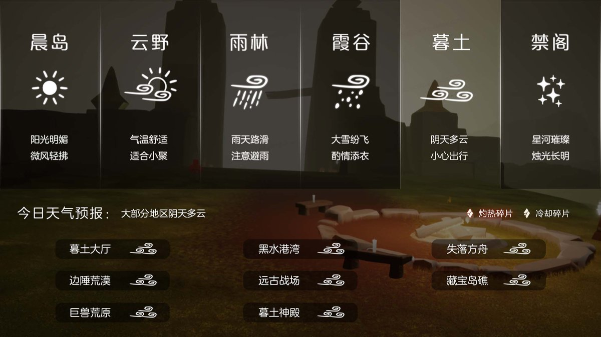

# 🌤 光遇每日任务

自动获取并展示《光·遇》每日任务和活动信息。

## 💡 项目说明

本项目通过自建 **SkyTools 控制台** 获取数据，使用 **GitHub Actions** 每日自动更新，将光遇的每日任务和活动信息展示在 README 中。

### 特性

- ✨ 每日自动更新任务和活动信息
- 🔒 账号与 Session 全部留在自建服务器，不外传
- 🚀 走 SkyTools `daily-tasks` 接口（游戏 `/account/get_season_quests`），无需第三方中转
- 📱 清晰的任务和活动展示
- ⏰ 北京时间每天 8:00 自动更新

---

<!-- DAILY_TASK_START -->
## 📅 2026年09月21日 每日任务

> 最后更新: 2026年09月21日 00:01:13 (北京时间)

### 🎯 今日旅行指南

**1. 拾起一只螃蟹**

【掀螃蟹】
在螃蟹周围长按角色，发出呐喊，即可掀翻周围的螃蟹哦。
走近被掀翻的螃蟹，会出现小图标，点击就可以抓起螃蟹啦~
如果小精灵的回答有帮助到您，请在右下角给小精灵点个赞哦~~

**2. 接受一位朋友的礼物**

【追光汇暖·相约同庆·合服专属奖励】
合服活动已圆满结束！
奖励领取于1月16日24点截止，
现已停止领取。
感谢您的理解与支持！

**3. 点亮一位玩家**

亲爱的旅人，在游戏中，遇见“陌生人小黑”时，在ta的身边，会出现一个点火的图标，点击图标即可拿出蜡烛来点火与对方点亮

**4. 拍一张鸟类的照片**

【截图】
截图说明：
游戏内『截图功能』取高清截图，可以隐藏界面UI
1、点击屏幕弹出右下角『摄影菜单』
2、点击『照相机』图标进行截图
3、双击右下角的方式进行快速截图
4、截图后图片会自动保存到设备相册中
注意：如果相册里面没有截图，请注意检查手机是否对游戏开通了照片访问权限。

### 🌤️ 天气预报

天气播报：今日无碎片降落

### 📅 本月日历

### 🎪 今日活动

今日暂无特殊活动

---

<!-- DAILY_TASK_END -->
