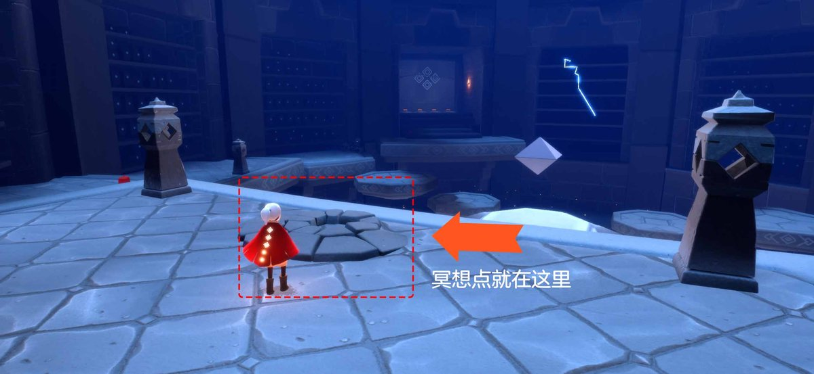
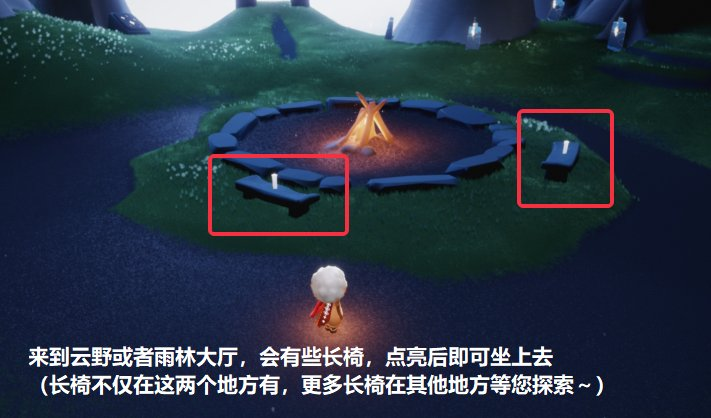
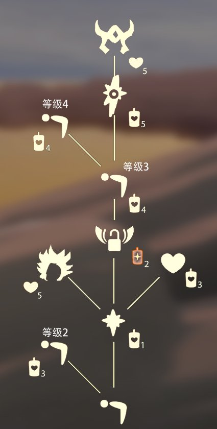
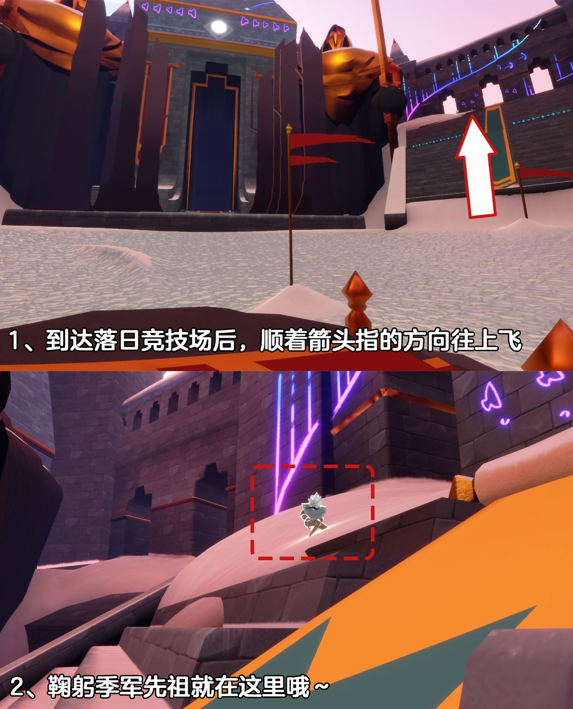
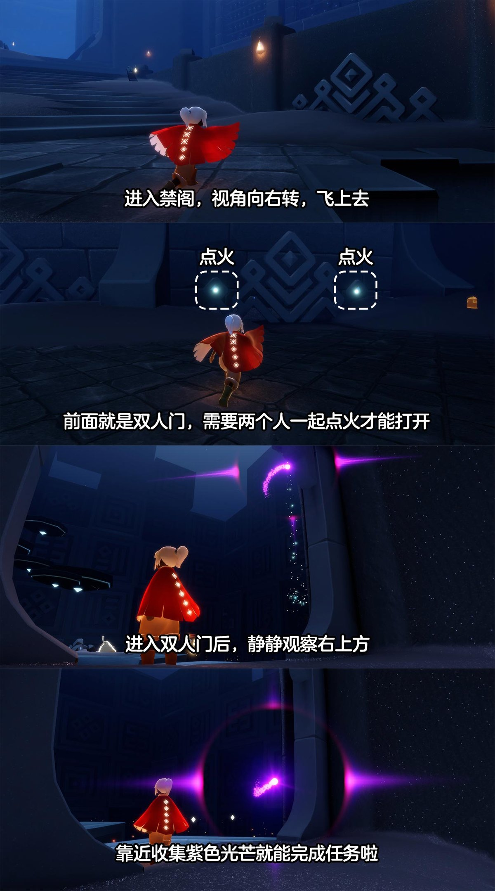
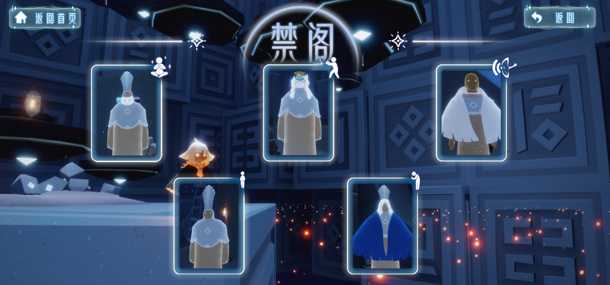
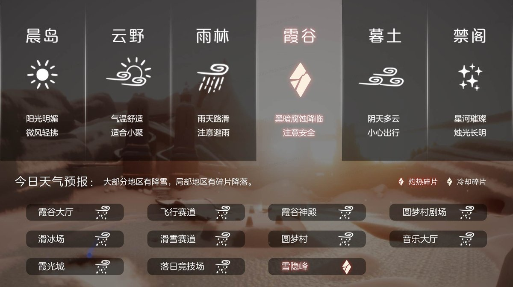
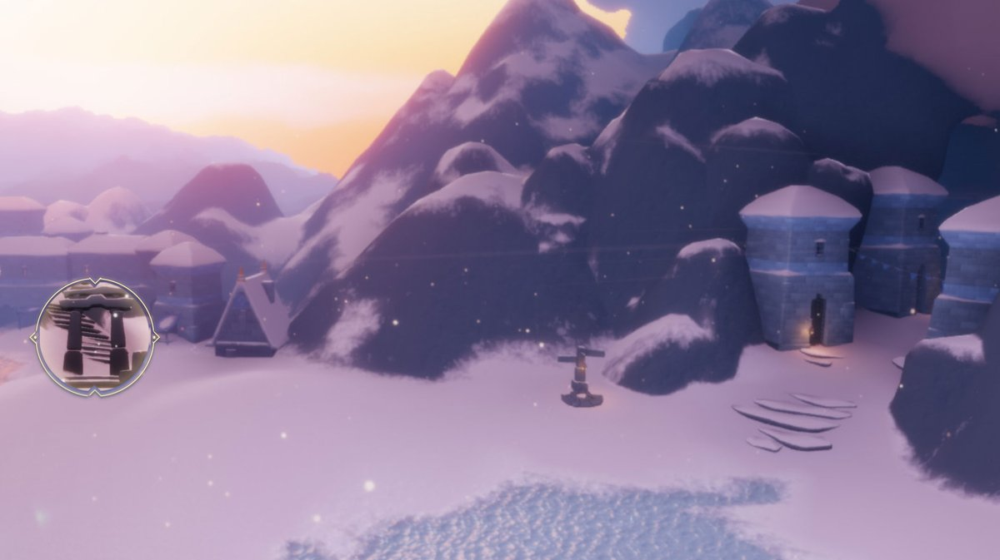

# 🌤 光遇每日任务

自动获取并展示《光·遇》每日任务和活动信息。

## 💡 项目说明

本项目通过自建 **SkyTools 控制台** 获取数据，使用 **GitHub Actions** 每日自动更新，将光遇的每日任务和活动信息展示在 README 中。

### 特性

- ✨ 每日自动更新任务和活动信息
- 🔒 账号与 Session 全部留在自建服务器，不外传
- 🚀 走 SkyTools `daily-tasks` 接口（游戏 `/account/get_season_quests`），无需第三方中转
- 📱 清晰的任务和活动展示
- ⏰ 北京时间每天 8:00 自动更新

---

<!-- DAILY_TASK_START -->
## 📅 2026年09月20日 每日任务

> 最后更新: 2026年09月20日 00:01:17 (北京时间)

### 🎯 今日旅行指南

**1. 在禁阁第二层冥想**

【每日任务－在禁阁第二层冥想】
位置：禁阁－禁阁二层
指引：
进入禁阁后，往前走，通过机关电梯一路向上

**2. 和陌生人一起坐在长凳上**

【和陌生人一起坐在长凳上】
步骤：
1.找到长凳(通常可在云野或雨林大厅中找到)
2.点亮长凳上的蜡烛
3.与陌生人(小黑)共坐同一张长凳

**3. 向一位玩家鞠躬**

【动作·鞠躬】 装扮、道具兑换指南服装收集
兑换先祖：霞谷·鞠躬季军 点击查看：先祖位置鞠躬季军
兑换图鉴：

【先祖怎么收集？服装怎么兑换？一次性说清楚！】

大神推荐： 梦想季熊抱雪人先祖收集攻略

【霞谷·鞠躬季军】
先祖位置：从霞谷的赛道一路滑行到达霞谷落日竞技场，神庙的右边城墙下有三个门洞，先祖在第一个门洞前等候~
视频攻略：

兑换图鉴：

**4. 收集紫色光芒**

【每日任务－紫色光芒】
位置：禁阁右侧双人门
指引：进入禁阁后往右飞，进入双人门后往前走，在右侧建筑附近即可找到
温馨提示：
1、双人门需要两个人一起点火才能打开，可以喊上好朋友一起完成任务
2、进入双人门需要先收集一名禁阁的常驻先祖哦
3、紫色光芒第一时间没见到，可以等待一会静静观察
图文介绍：
视频介绍：

点击上面的先祖即可查看对应先祖位置哦 (•̀ᴗ-)✧

### 🌤️ 天气预报

天气播报：今日将会有灼热碎片坠落在雪隐峰
预测时间：07点08分、13点08分、19点08分（以游戏实际降落为准）

### 📅 本月日历

### 🎪 今日活动

今日暂无特殊活动

---

<!-- DAILY_TASK_END -->
