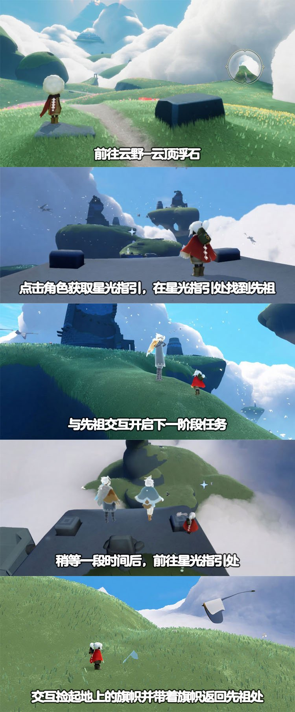
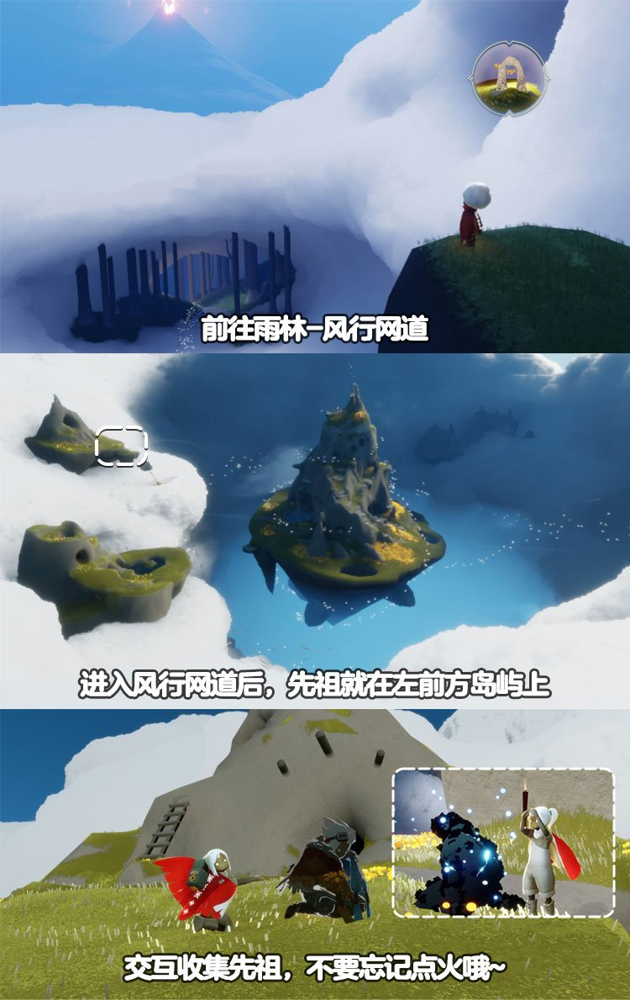

# 🌤 光遇每日任务

自动获取并展示《光·遇》每日任务和活动信息。

## 💡 项目说明

本项目通过自建 **SkyTools 控制台** 获取数据，使用 **GitHub Actions** 每日自动更新，将光遇的每日任务和活动信息展示在 README 中。

### 特性

- ✨ 每日自动更新任务和活动信息
- 🔒 账号与 Session 全部留在自建服务器，不外传
- 🚀 走 SkyTools `daily-tasks` 接口（游戏 `/account/get_season_quests`），无需第三方中转
- 📱 清晰的任务和活动展示
- ⏰ 北京时间每天 8:00 自动更新

---

<!-- DAILY_TASK_START -->
## 📅 2026年09月21日 每日任务

> 最后更新: 2026年09月21日 00:40:10 (北京时间)

### 🎯 今日旅行指南

**1. 拾起一只螃蟹**

【掀螃蟹】
在螃蟹周围长按角色，发出呐喊，即可掀翻周围的螃蟹哦。
走近被掀翻的螃蟹，会出现小图标，点击就可以抓起螃蟹啦~
如果小精灵的回答有帮助到您，请在右下角给小精灵点个赞哦~~

**2. 接受一位朋友的礼物**

【追光汇暖·相约同庆·合服专属奖励】
合服活动已圆满结束！
奖励领取于1月16日24点截止，
现已停止领取。
感谢您的理解与支持！

**3. 点亮一位玩家**

亲爱的旅人，在游戏中，遇见“陌生人小黑”时，在ta的身边，会出现一个点火的图标，点击图标即可拿出蜡烛来点火与对方点亮

**4. 帮助风行领航员**

【每日任务－帮助风行领航员】
请旅人先查看接到的任务名称，然后在下方选择对应指南
｜
小精灵提示：
1、若旅人从未收集过该先祖，任务会显示为：在风行网道找到风行领航员；
2、若旅人之前已收集过该先祖，任务会显示为：风行领航员在云顶浮石需要帮助

【风行领航员在云顶浮石需要帮助】
任务地点：云野·云顶浮石
任务流程：
1、在云顶浮石按提示找到先祖
2、与其互动后开启下一阶段任务
3、捡起星光指引处的旗帜并将旗帜带回给先祖后完成任务

【在风行网道找到风行领航员】
任务流程：
1、在风行网道找到并收集先祖
2、接着前往云野-云顶浮石
3、在云顶浮石按提示找到先祖
4、与其互动后，打坐开启比赛
5、跟随风向标的指引到达终点后即可

### 🌤️ 天气预报

天气播报：今日无碎片降落

### 📅 本月日历

### 🎪 今日活动

今日暂无特殊活动

---

<!-- DAILY_TASK_END -->
