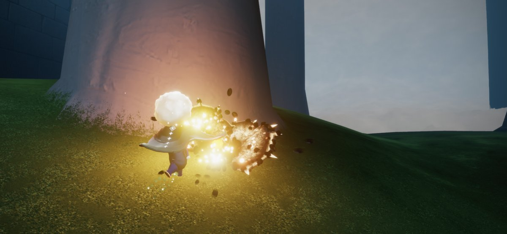
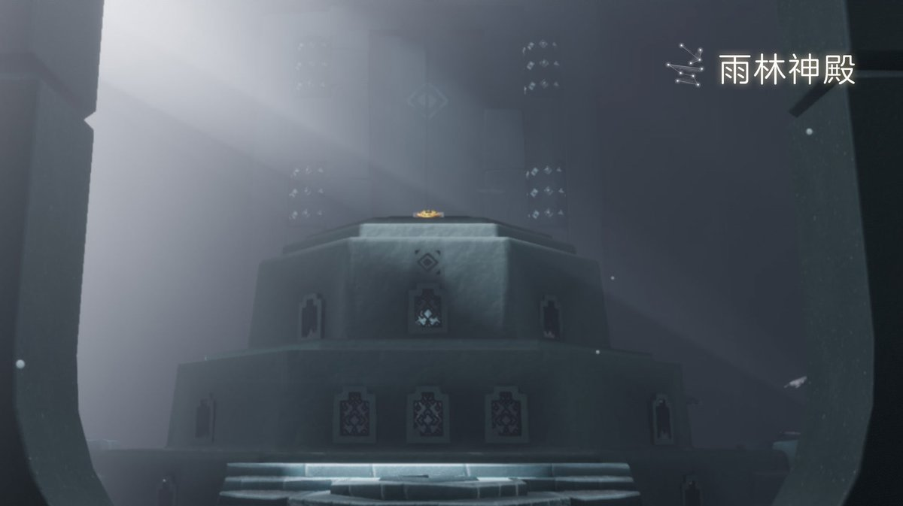
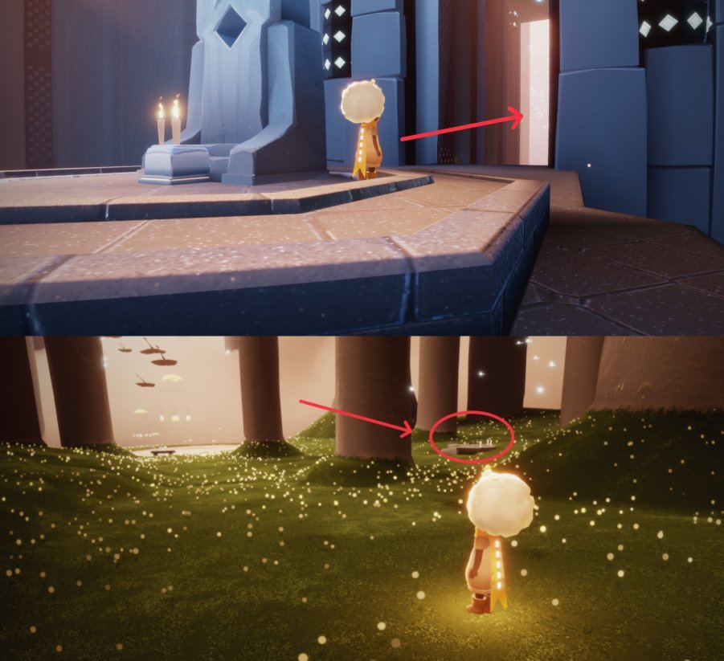
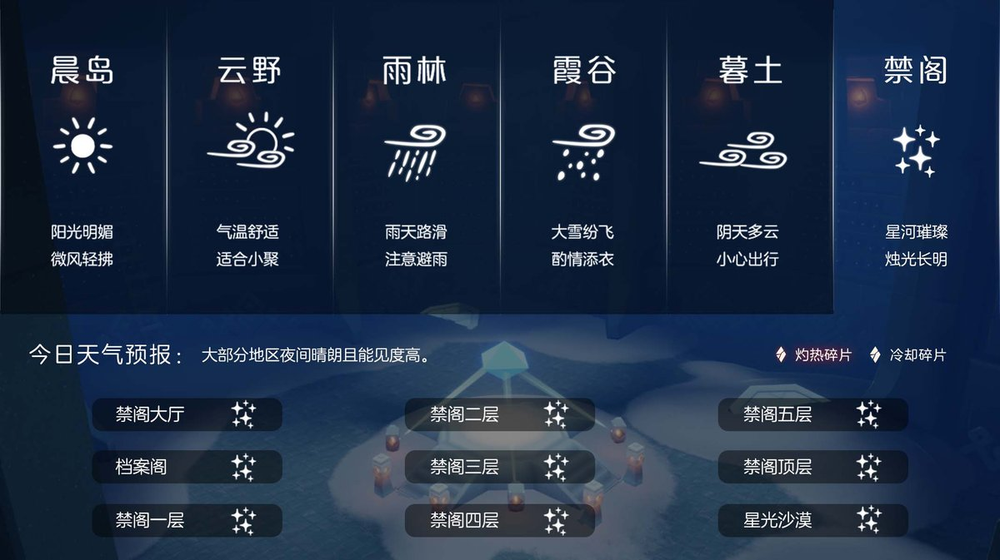

# 🌤 光遇每日任务

自动获取并展示《光·遇》每日任务和活动信息。

## 💡 项目说明

本项目通过自建 **SkyTools 控制台** 获取数据，使用 **GitHub Actions** 每日自动更新，将光遇的每日任务和活动信息展示在 README 中。

### 特性

- ✨ 每日自动更新任务和活动信息
- 🔒 账号与 Session 全部留在自建服务器，不外传
- 🚀 走 SkyTools `daily-tasks` 接口（游戏 `/account/get_season_quests`），无需第三方中转
- 📱 清晰的任务和活动展示
- ⏰ 北京时间每天 8:00 自动更新

---

<!-- DAILY_TASK_START -->
## 📅 2026年09月17日 每日任务

> 最后更新: 2026年09月17日 13:35:53 (北京时间)

### 🎯 今日旅行指南

**1. 在中央神坛提交风筝设计方案**

【在中央神坛提交风筝设计方案】
地点：云野·中央神坛
步骤：
1.先前往中央神坛
2.找到任务地点
3.与先祖交互获得风筝材料
4.选择心仪的颜色为风筝材料染色
5.选择一款最喜欢的风筝，将风筝材料提交给对应先祖即可完成任务

**2. 净化10株黑暗植物**

【每日任务－净化10株黑暗植物】
1.地点：在雨林与暮土比较容易找到
2.净化：黑暗植物大小不一，旅人们可以举着蜡烛靠近，在火光的持续灼烧下黑暗植物会被清除。

**3. 接受一位朋友的礼物**

【追光汇暖·相约同庆·合服专属奖励】
合服活动已圆满结束！
奖励领取于1月16日24点截止，
现已停止领取。
感谢您的理解与支持！

**4. 在雨林的神坛旁冥想**

【每日任务－在雨林的神庙内冥想】
任务：在雨林的神庙内冥想
位置：在雨林－终点图树后方
步骤：进入雨林的终点图后，往前走一点点，在右方的树后面
温馨提示：看不了图片或视频的旅人可尝试刷新，或在网络较好的地点再试试哦

### 🌤️ 天气预报

天气播报：今日无碎片降落

### 📅 本月日历

### 🎪 今日活动

今日暂无特殊活动

---

<!-- DAILY_TASK_END -->
