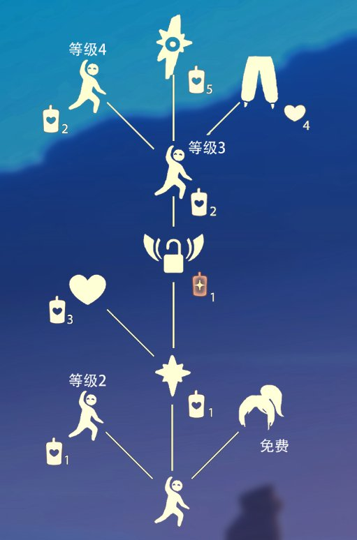
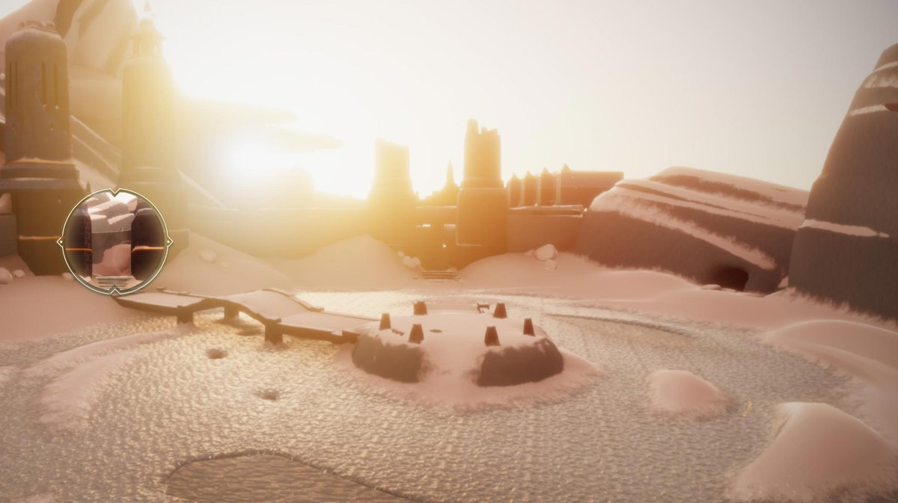
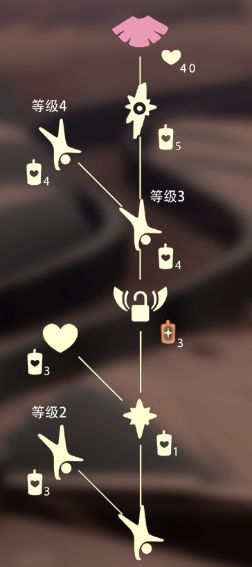
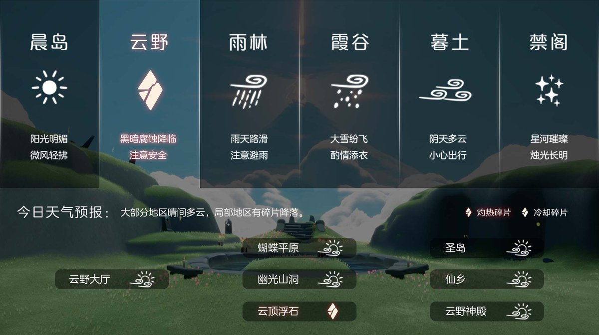
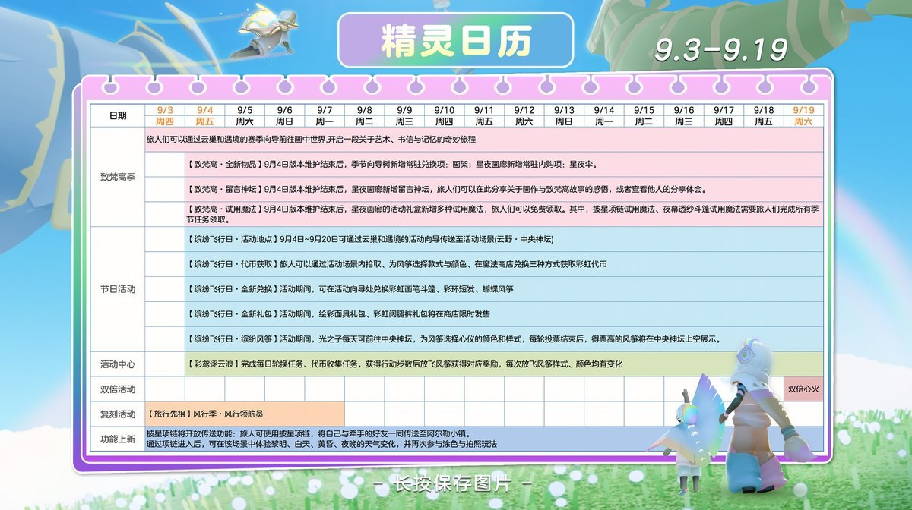

# 🌤 光遇每日任务

自动获取并展示《光·遇》每日任务和活动信息。

## 💡 项目说明

本项目通过自建 **SkyTools 控制台** 获取数据，使用 **GitHub Actions** 每日自动更新，将光遇的每日任务和活动信息展示在 README 中。

### 特性

- ✨ 每日自动更新任务和活动信息
- 🔒 账号与 Session 全部留在自建服务器，不外传
- 🚀 走 SkyTools `daily-tasks` 接口（游戏 `/account/get_season_quests`），无需第三方中转
- 📱 清晰的任务和活动展示
- ⏰ 北京时间每天 8:00 自动更新

---

<!-- DAILY_TASK_START -->
## 📅 2026年09月18日 每日任务

> 最后更新: 2026年09月18日 00:32:59 (北京时间)

### 🎯 今日旅行指南

**1. 和朋友击掌**

【和朋友击掌】
1.点击好友头顶的图标
2.解锁好友树里的击掌动作
3.点击击掌动作，发起击掌申请
4.好友接受击掌申请，即可和朋友击掌
点击查看：好友树

**2. 向一位朋友招手**

【动作·招手】 装扮、道具兑换指南服装收集
兑换先祖：晨岛·引路观星者
兑换图鉴：

【先祖怎么收集？服装怎么兑换？一次性说清楚！】

大神推荐： 梦想季熊抱雪人先祖收集攻略

**3. 和陌生人坐在长凳上**

亲爱的旅人，在天空王国中，陌生人会以小黑的姿态出现在您的面前，您可通过与小黑点火(靠近即可点火)，来查看陌生人的装扮
【和陌生人一起坐在长凳上】
步骤：
1.找到长凳(通常可在云野或雨林大厅中找到)
2.点亮长凳上的蜡烛
3.与陌生人(小黑)共坐同一张长凳

**4. 前往霞谷重温倒立探险者的回忆**

【霞谷·倒立探险者】
位置：霞谷－霞光城
指引：
1.进入霞谷后，一路往前走，前往滑冰场
2.来到滑冰场后，往左走前往霞光城

兑换图鉴：
温馨提示：
1、看不了图片的旅人可尝试刷新，或在网络较好的地点再试试哦；
2、若在图示位置找不到先祖，有可能是因为其他旅人正在收集，可重新进入地图再试试看～

### 🌤️ 天气预报

天气播报：今日将会有灼热碎片坠落在云顶浮石
预测时间：11点08分、17点08分、23点08分（以游戏实际降落为准）

### 📅 本月日历

### 🎪 今日活动

今日暂无特殊活动

---

<!-- DAILY_TASK_END -->
