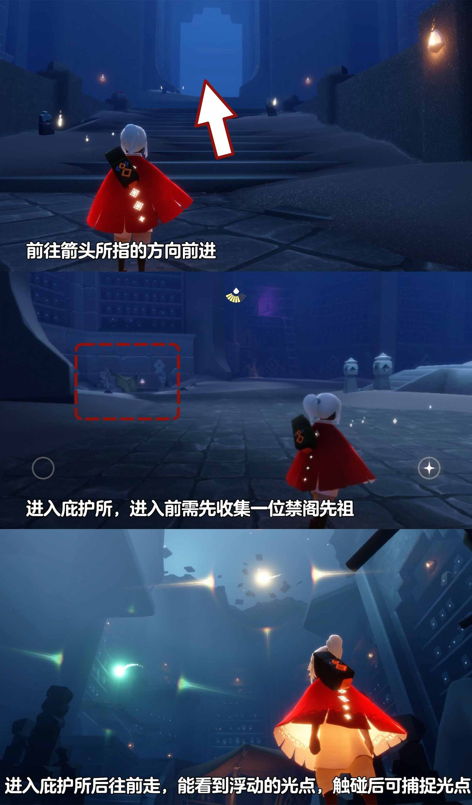
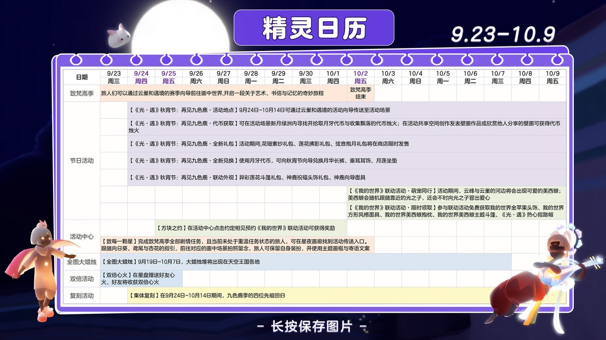

# 🌤 光遇每日任务

自动获取并展示《光·遇》每日任务和活动信息。

## 💡 项目说明

本项目通过自建 **SkyTools 控制台** 获取数据，使用 **GitHub Actions** 每日自动更新，将光遇的每日任务和活动信息展示在 README 中。

### 特性

- ✨ 每日自动更新任务和活动信息
- 🔒 账号与 Session 全部留在自建服务器，不外传
- 🚀 走 SkyTools `daily-tasks` 接口（游戏 `/account/get_season_quests`），无需第三方中转
- 📱 清晰的任务和活动展示
- ⏰ 北京时间每天 8:00 自动更新

---

<!-- DAILY_TASK_START -->
## 📅 2026年09月25日 每日任务

> 最后更新: 2026年09月25日 00:01:11 (北京时间)

### 🎯 今日旅行指南

**1. 在禁阁的庇护所中捕捉浮动的光点**

【在禁阁的庇护所中捕捉浮动的光点】
1、前往禁阁大厅，进入庇护所
2、进入庇护所后往前走，浮动的光点就在前方飞
3、触碰后可捕捉光点
小精灵提醒您：
1、进入庇护前所需要收集一位禁阁常驻先祖
2、需要收集三个光点
3、在收集过程中若光点消失，旅人可尝试重新进入地图
视频攻略：

**2. 掀翻5只螃蟹**

旅人们在螃蟹周围长按角色，发出呐喊，即可掀翻周围的螃蟹哦。走近后会出现小图标，点击就可以抓螃蟹了~

**3. 接受一位朋友的礼物**

【追光汇暖·相约同庆·合服专属奖励】
合服活动已圆满结束！
奖励领取于1月16日24点截止，
现已停止领取。
感谢您的理解与支持！

**4. 找到一名位于禁阁的先祖**

【每日任务-找到一名位于禁阁的先祖】
1.前往禁阁
2.任意收集一个位于禁阁的先祖均可以完成任务
小精灵收到前线报道：灵语者先祖不参与本次活动，请旅人们收集其他禁阁先祖

点击上面的先祖即可查看对应先祖位置哦 (•̀ᴗ-)✧

### 🌤️ 天气预报

天气播报：今日将会有灼热碎片坠落在圆梦村
预测时间：11点08分、17点08分、23点08分（以游戏实际降落为准）

### 📅 本月日历

### 🎪 今日活动

今日暂无特殊活动

---

<!-- DAILY_TASK_END -->
