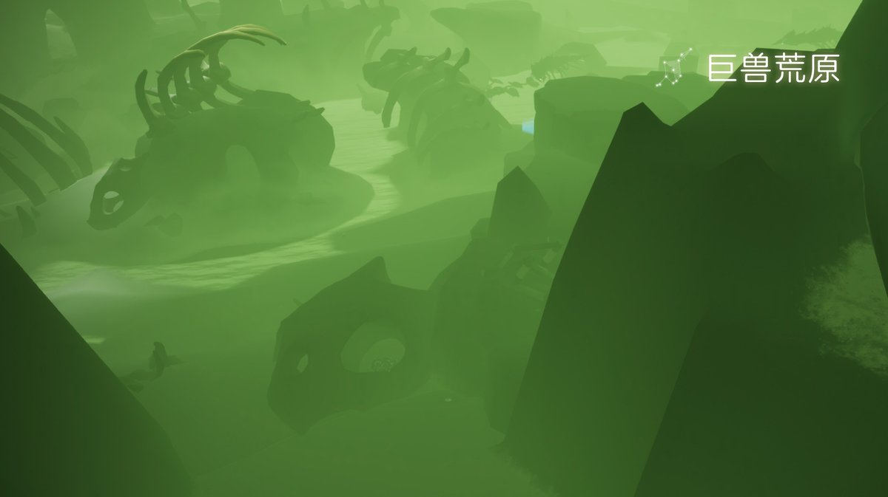
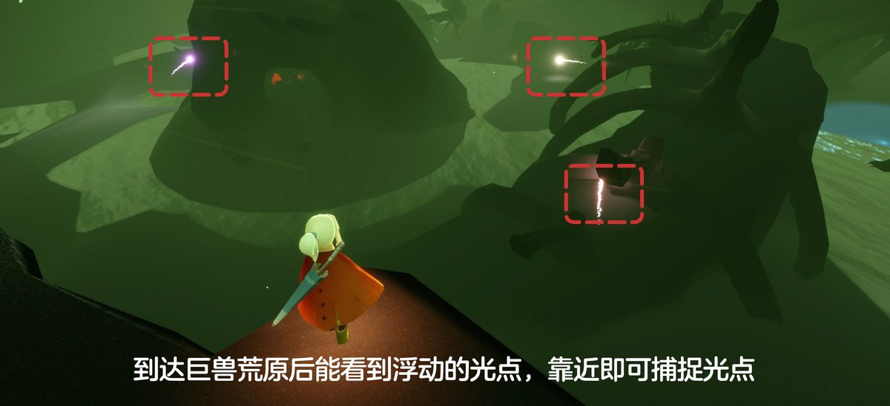

# 🌤 光遇每日任务

自动获取并展示《光·遇》每日任务和活动信息。

## 💡 项目说明

本项目通过自建 **SkyTools 控制台** 获取数据，使用 **GitHub Actions** 每日自动更新，将光遇的每日任务和活动信息展示在 README 中。

### 特性

- ✨ 每日自动更新任务和活动信息
- 🔒 账号与 Session 全部留在自建服务器，不外传
- 🚀 走 SkyTools `daily-tasks` 接口（游戏 `/account/get_season_quests`），无需第三方中转
- 📱 清晰的任务和活动展示
- ⏰ 北京时间每天 8:00 自动更新

---

<!-- DAILY_TASK_START -->
## 📅 2026年09月24日 每日任务

> 最后更新: 2026年09月24日 00:06:15 (北京时间)

### 🎯 今日旅行指南

**1. wave at a player**

**2. 在巨兽荒原捕捉浮动的光点**

【在巨兽荒原捕捉3个光点】
1.先前往暮土大厅
2.一直往前飞，穿过边陲荒漠
3.到达巨兽荒原，能看到浮动的光点，触碰后可捕捉光点
小精灵提醒您：
1、巨兽荒原有冥龙盘旋，旅人们收集时请万分小心
2、需要收集三个光点
3、在收集过程中若光点消失，旅人可尝试重新进入地图

**3. 和朋友击掌**

【和朋友击掌】
1.点击好友头顶的图标
2.解锁好友树里的击掌动作
3.点击击掌动作，发起击掌申请
4.好友接受击掌申请，即可和朋友击掌
点击查看：好友树

**4. 面对冥龙**

【每日任务－面对冥龙】
如何完成：被冥龙的探照灯照到一下即可完成
推荐地点：暮土二图，旅途中第一次遇到冥龙的地方
温馨提示：若身边有小黑或者其他旅人，会出现冥龙探测到其他人而探测不到自己，所以请尽量避免与其他人一起完成该任务哦(牵手除外)
推荐地点视频指引：

### 🌤️ 天气预报

天气播报：今日无碎片降落

### 📅 本月日历

### 🎪 今日活动

今日暂无特殊活动

---

<!-- DAILY_TASK_END -->
