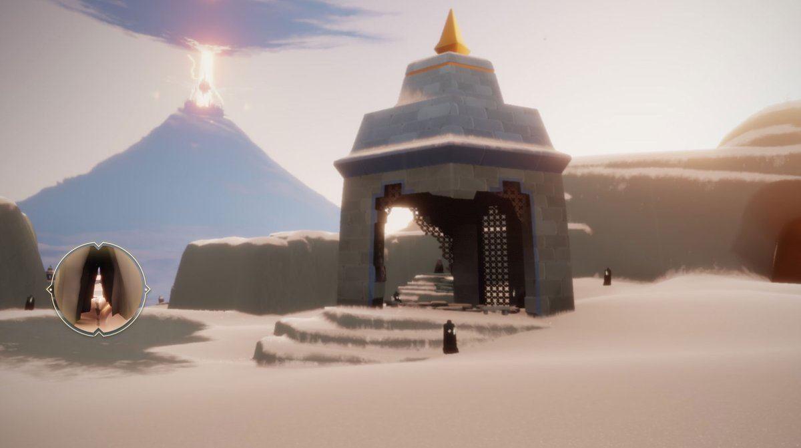
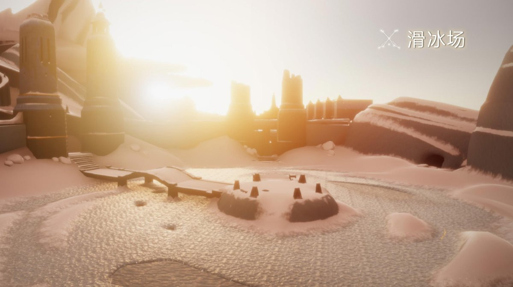
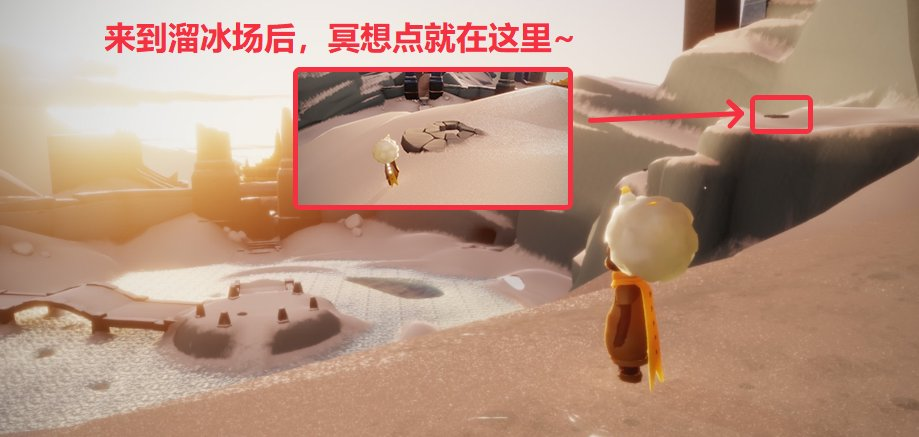
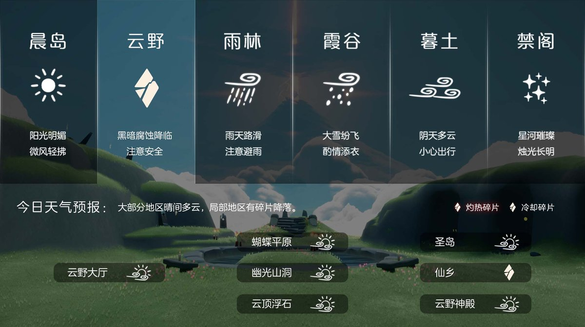

# 🌤 光遇每日任务

自动获取并展示《光·遇》每日任务和活动信息。

## 💡 项目说明

本项目通过自建 **SkyTools 控制台** 获取数据，使用 **GitHub Actions** 每日自动更新，将光遇的每日任务和活动信息展示在 README 中。

### 特性

- ✨ 每日自动更新任务和活动信息
- 🔒 账号与 Session 全部留在自建服务器，不外传
- 🚀 走 SkyTools `daily-tasks` 接口（游戏 `/account/get_season_quests`），无需第三方中转
- 📱 清晰的任务和活动展示
- ⏰ 北京时间每天 8:00 自动更新

---

<!-- DAILY_TASK_START -->
## 📅 2026年09月23日 每日任务

> 最后更新: 2026年09月23日 00:01:13 (北京时间)

### 🎯 今日旅行指南

**1. 在水母上恢复能量**

【每日任务－在水母上恢复能量】
位置：密林遗迹(水母图)
步骤：密林遗迹后往前飞，来到终点图前的雨亭，点亮蜡烛即可召唤出一排水母
注意：几乎消耗完能量后再跳上水母会更容易完成任务哦

**2. 接受一位朋友的礼物**

【追光汇暖·相约同庆·合服专属奖励】
合服活动已圆满结束！
奖励领取于1月16日24点截止，
现已停止领取。
感谢您的理解与支持！

**3. 收集30点烛火**

亲爱的旅人，若出现烛火、代币收取不正常的情况，可尝试重启登录游戏
若一直出现该问题，您可以通过以下方式反馈BUG和联系我们：
官方网站：
客服电话：95163920
登录客服专区：点击左侧客户服务，填写您的问题或建议详情，工作人员会尽快给您处理的哦～

**4. 在滑冰场旁冥想**

【每日任务－在滑冰场旁冥想】
任务：在滑冰场旁冥想
位置：在霞谷－滑冰场
步骤：进入霞谷后一直往前滑就能来到滑冰场，冥想点就在滑冰场右上方
视频指南：

### 🌤️ 天气预报

天气播报：今日将会有冷却碎片坠落在仙乡
预测时间：09点08分、15点08分、21点08分（以游戏实际降落为准）

### 📅 本月日历

### 🎪 今日活动

今日暂无特殊活动

---

<!-- DAILY_TASK_END -->
