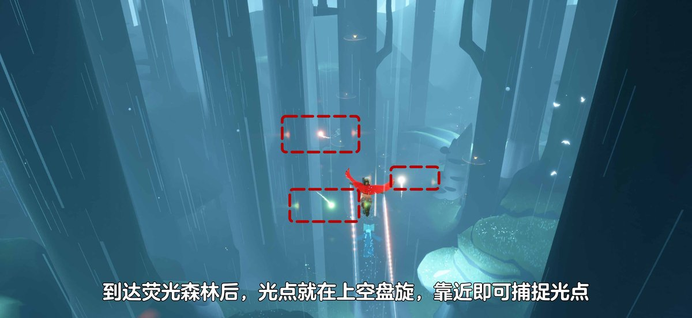
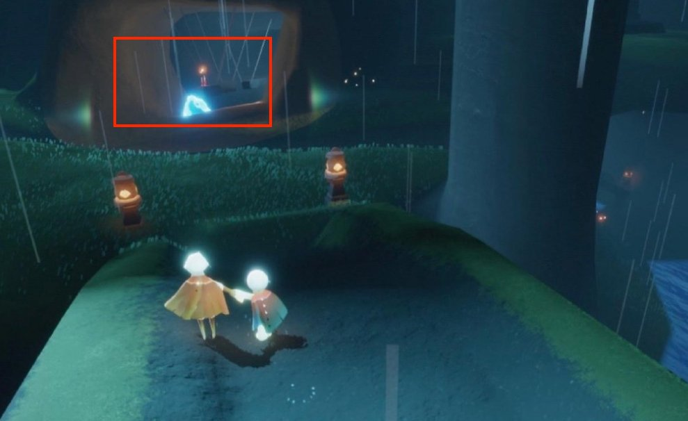
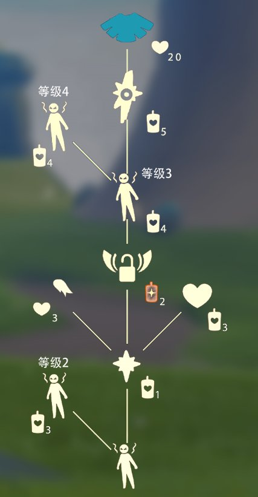

# 🌤 光遇每日任务

自动获取并展示《光·遇》每日任务和活动信息。

## 💡 项目说明

本项目通过自建 **SkyTools 控制台** 获取数据，使用 **GitHub Actions** 每日自动更新，将光遇的每日任务和活动信息展示在 README 中。

### 特性

- ✨ 每日自动更新任务和活动信息
- 🔒 账号与 Session 全部留在自建服务器，不外传
- 🚀 走 SkyTools `daily-tasks` 接口（游戏 `/account/get_season_quests`），无需第三方中转
- 📱 清晰的任务和活动展示
- ⏰ 北京时间每天 8:00 自动更新

---

<!-- DAILY_TASK_START -->
## 📅 2026年09月22日 每日任务

> 最后更新: 2026年09月22日 00:01:13 (北京时间)

### 🎯 今日旅行指南

**1. 在荧光森林捕捉浮动的光点**

【在荧光森林捕捉浮动的光点】
1.进入雨林后，一路往前，前往静谧庭院
2.直走穿过静谧庭院，即可到达荧光森林
3.到达荧光森林，能看到天空上浮动的光点，触碰后可捕捉光点
小精灵提醒您：
1、旅人们收集时请万分小心，护佑心火
2、需要收集三个光点
3、在收集过程中若光点消失，旅人可尝试重新进入地图

**2. 向一位朋友做个动作**

【好友互动动作】
使用：点击好友头上的互动按钮，在好友菜单里选择动作
温馨提示：某些互动动作需要先通过先祖或旅行先祖解锁才能获得

**3. 掀翻5只螃蟹**

【掀螃蟹】
在螃蟹周围长按角色，发出呐喊，即可掀翻周围的螃蟹哦。
走近被掀翻的螃蟹，会出现小图标，点击就可以抓起螃蟹啦~
如果小精灵的回答有帮助到您，请在右下角给小精灵点个赞哦~~

**4. 前往雨林-荧光森林，重温娇嗔搬运工的回忆**

【雨林·娇嗔搬运工】
先祖位置：进入雨林荧光森林后，沿小河走到小桥前，上桥后向左走，先祖在洞口静静等候~
兑换图鉴：

### 🌤️ 天气预报

天气播报：今日无碎片降落

### 📅 本月日历

### 🎪 今日活动

今日暂无特殊活动

---

<!-- DAILY_TASK_END -->
