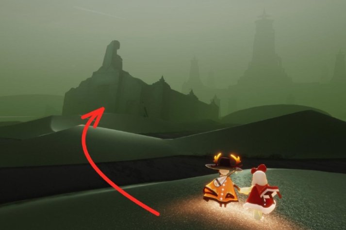
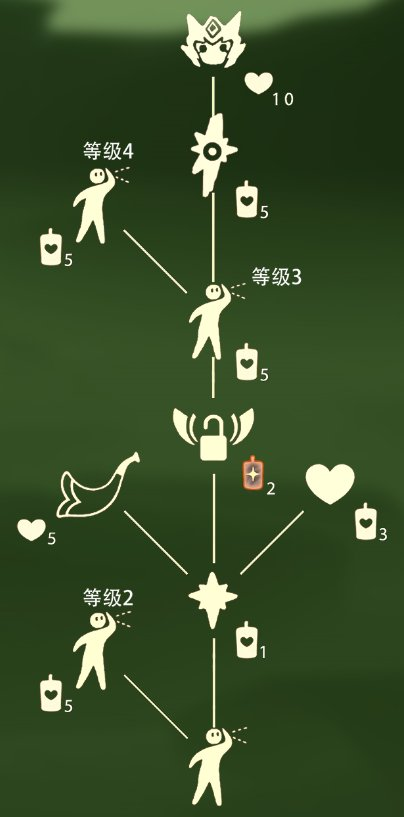
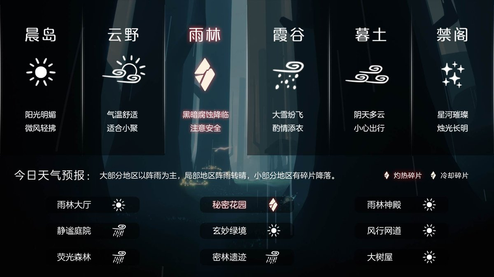

# 🌤 光遇每日任务

自动获取并展示《光·遇》每日任务和活动信息。

## 💡 项目说明

本项目通过自建 **SkyTools 控制台** 获取数据，使用 **GitHub Actions** 每日自动更新，将光遇的每日任务和活动信息展示在 README 中。

### 特性

- ✨ 每日自动更新任务和活动信息
- 🔒 账号与 Session 全部留在自建服务器，不外传
- 🚀 走 SkyTools `daily-tasks` 接口（游戏 `/account/get_season_quests`），无需第三方中转
- 📱 清晰的任务和活动展示
- ⏰ 北京时间每天 8:00 自动更新

---

<!-- DAILY_TASK_START -->
## 📅 2026年10月04日 每日任务

> 最后更新: 2026年10月04日 00:40:12 (北京时间)

### 🎯 今日旅行指南

**1. 在巨兽荒原的神坛旁冥想**

【每日任务－在巨兽荒原的神坛旁冥想】
任务：在巨兽荒原的神坛旁冥想
位置：暮土－巨兽荒原(四龙图)
步骤：先进入暮土四龙图，往前飞，在下一个图的入口附近即可找到
大神推荐：查收你的光翼收集报告

**2. 和陌生人一起坐在长凳上**

【和陌生人一起坐在长凳上】
步骤：
1.找到长凳(通常可在云野或雨林大厅中找到)
2.点亮长凳上的蜡烛
3.与陌生人(小黑)共坐同一张长凳

**3. 点亮一位玩家**

亲爱的旅人，在游戏中，遇见“陌生人小黑”时，在ta的身边，会出现一个点火的图标，点击图标即可拿出蜡烛来点火与对方点亮

**4. 前往暮土-远古战场，重温瞭望哨兵的回忆**

【暮土·瞭望哨兵】
先祖位置：从巨兽荒原到达 ，从有尖顶的城墙下穿过，左侧的石阶上，失落的先祖在此等候~
视频攻略：
，或在网络较好的地点再试试哦，感谢旅人的支持！）
兑换图鉴：

【远古战场】
介绍：亲爱的旅人们，远古战场出现在暮土第三个场景中
点击查看：
大神推荐：查收你的光翼收集报告

### 🌤️ 天气预报

天气播报：大部分地区地区阴天多云，秘密花园将会有灼热碎片降落
降落时间：07点08分、13点08分、19点08分（以游戏实际降落为准）

### 📅 本月日历

### 🎪 今日活动

今日暂无特殊活动

---

<!-- DAILY_TASK_END -->
