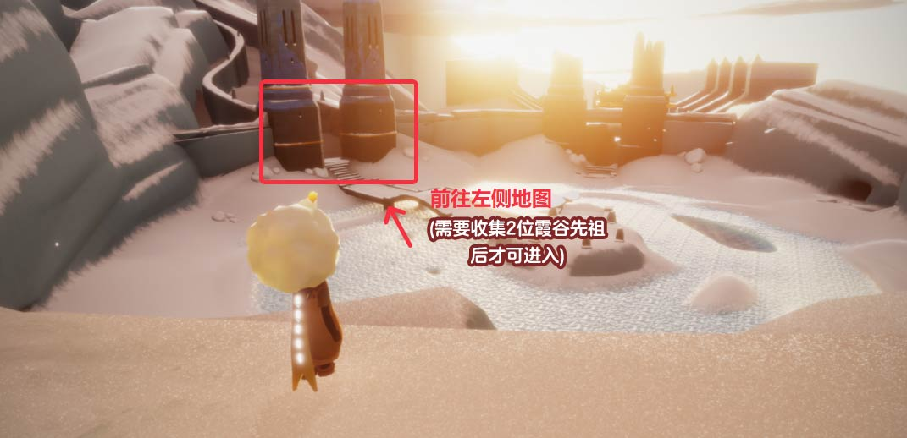
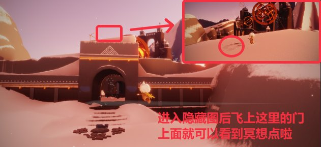
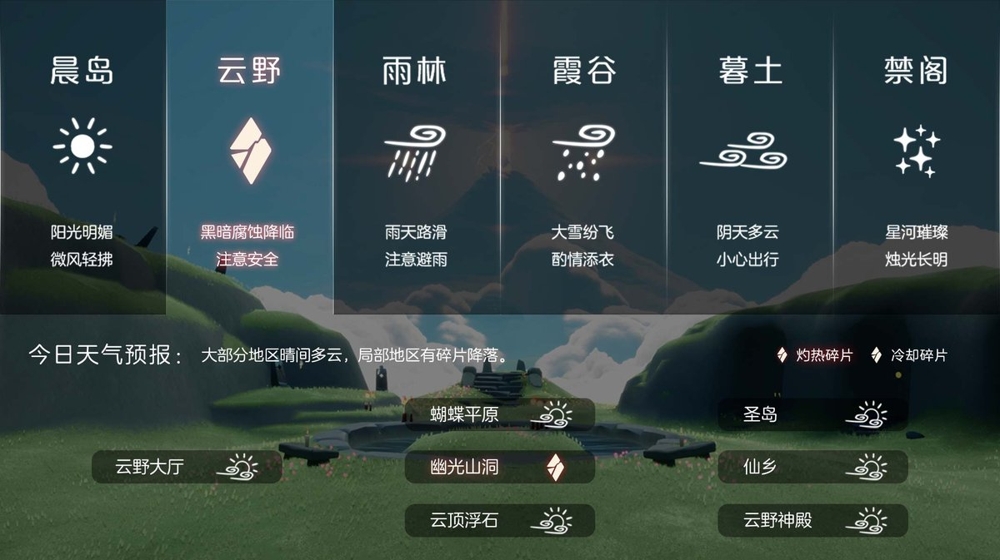

# 🌤 光遇每日任务

自动获取并展示《光·遇》每日任务和活动信息。

## 💡 项目说明

本项目通过自建 **SkyTools 控制台** 获取数据，使用 **GitHub Actions** 每日自动更新，将光遇的每日任务和活动信息展示在 README 中。

### 特性

- ✨ 每日自动更新任务和活动信息
- 🔒 账号与 Session 全部留在自建服务器，不外传
- 🚀 走 SkyTools `daily-tasks` 接口（游戏 `/account/get_season_quests`），无需第三方中转
- 📱 清晰的任务和活动展示
- ⏰ 北京时间每天 8:00 自动更新

---

<!-- DAILY_TASK_START -->
## 📅 2026年10月03日 每日任务

> 最后更新: 2026年10月03日 00:01:18 (北京时间)

### 🎯 今日旅行指南

**1. 和朋友击掌**

【和朋友击掌】
1.点击好友头顶的图标
2.解锁好友树里的击掌动作
3.点击击掌动作，发起击掌申请
4.好友接受击掌申请，即可和朋友击掌
点击查看：好友树

**2. 接受一位朋友的礼物**

【追光汇暖·相约同庆·合服专属奖励】
合服活动已圆满结束！
奖励领取于1月16日24点截止，
现已停止领取。
感谢您的理解与支持！

**3. 向一位朋友招手**

【动作·招手】 装扮、道具兑换指南服装收集
兑换先祖：晨岛·引路观星者
兑换图鉴：

【先祖怎么收集？服装怎么兑换？一次性说清楚！】

大神推荐： 梦想季熊抱雪人先祖收集攻略

**4. 在霞光城拱门上冥想**

【每日任务－在霞光城拱门上冥想】
任务：在霞光城拱门上冥想
位置：霞光城－城门上
步骤：通过霞谷溜冰场左侧的入口进入霞光城，在霞光城门口上面

### 🌤️ 天气预报

天气播报：大部分地区地区夜间晴朗，幽光山洞将会有灼热碎片降落
降落时间：10点08分、14点08分、22点08分（以游戏实际降落为准）

### 📅 本月日历

### 🎪 今日活动

今日暂无特殊活动

---

<!-- DAILY_TASK_END -->
