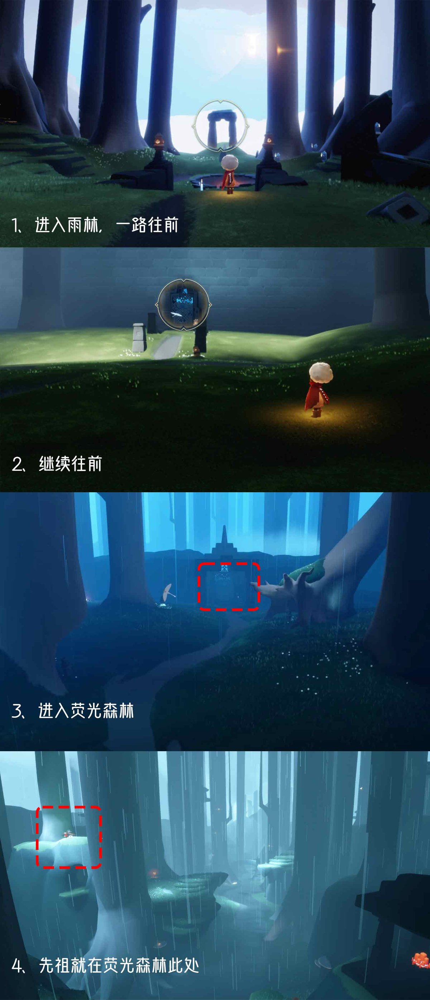

# 🌤 光遇每日任务

自动获取并展示《光·遇》每日任务和活动信息。

## 💡 项目说明

本项目通过自建 **SkyTools 控制台** 获取数据，使用 **GitHub Actions** 每日自动更新，将光遇的每日任务和活动信息展示在 README 中。

### 特性

- ✨ 每日自动更新任务和活动信息
- 🔒 账号与 Session 全部留在自建服务器，不外传
- 🚀 走 SkyTools `daily-tasks` 接口（游戏 `/account/get_season_quests`），无需第三方中转
- 📱 清晰的任务和活动展示
- ⏰ 北京时间每天 8:00 自动更新

---

<!-- DAILY_TASK_START -->
## 📅 2026年10月02日 每日任务

> 最后更新: 2026年10月02日 00:40:13 (北京时间)

### 🎯 今日旅行指南

**1. 在静谧庭院冥想**

【每日任务－在静谧庭院外冥想】
任务：在静谧庭院外冥想
位置：在雨林－静谧庭院
步骤：进入雨林大厅后往下飞下即是静谧庭院，着陆后往左前方跑即可看到

**2. 向一位玩家鞠躬**

【动作·鞠躬】 装扮、道具兑换指南服装收集
兑换先祖：霞谷·鞠躬季军 点击查看：先祖位置鞠躬季军
兑换图鉴：

【先祖怎么收集？服装怎么兑换？一次性说清楚！】

大神推荐： 梦想季熊抱雪人先祖收集攻略

【霞谷·鞠躬季军】
先祖位置：从霞谷的赛道一路滑行到达霞谷落日竞技场，神庙的右边城墙下有三个门洞，先祖在第一个门洞前等候~
视频攻略：

兑换图鉴：

**3. 在荧光小菇旁回复能量**

【荧光小菇】
小贴士：旅人们跳到荧光小菇上可补充能量
(能量几乎消耗完时再跳上去会更容易完成每日任务哦)
地点：荧光小菇是生长在雨林的植物。
特性：荧光小菇呈半透明状态并且会发光，旅人们站在荧光蘑菇上可以悬浮起来，极容易辨认。
如果小精灵的回答有帮助到您，请在右下角给小精灵点个赞哦~~

**4. 前往雨林-荧光森林，重温正步冒险家的回忆**

【集结季·正步冒险家位置】
先祖位置：雨林·荧光森林
图文指引：

### 🌤️ 天气预报

天气播报：今日无碎片降落

### 📅 本月日历

### 🎪 今日活动

今日暂无特殊活动

---

<!-- DAILY_TASK_END -->
