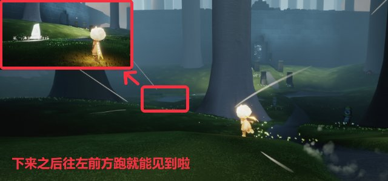
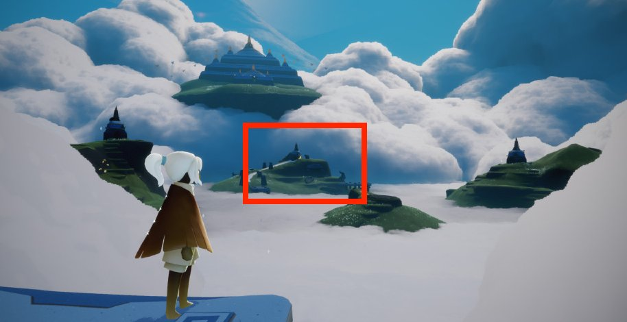
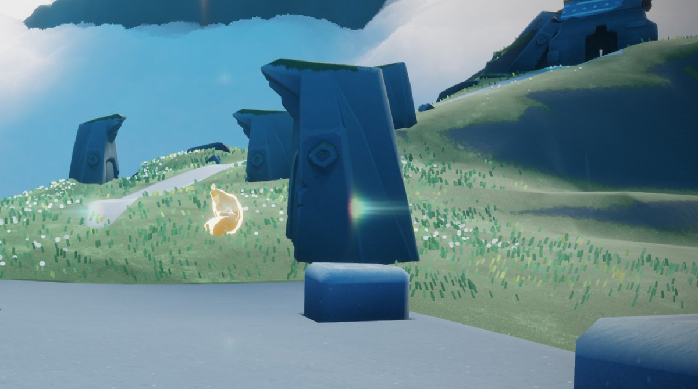
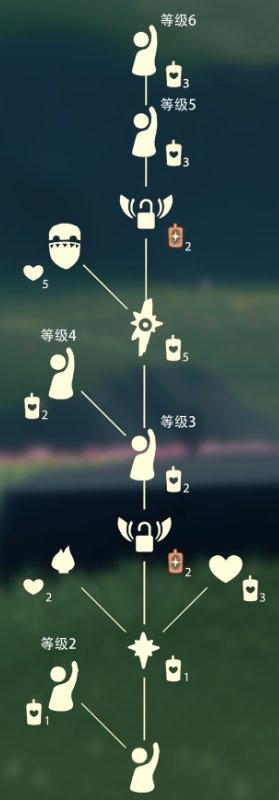
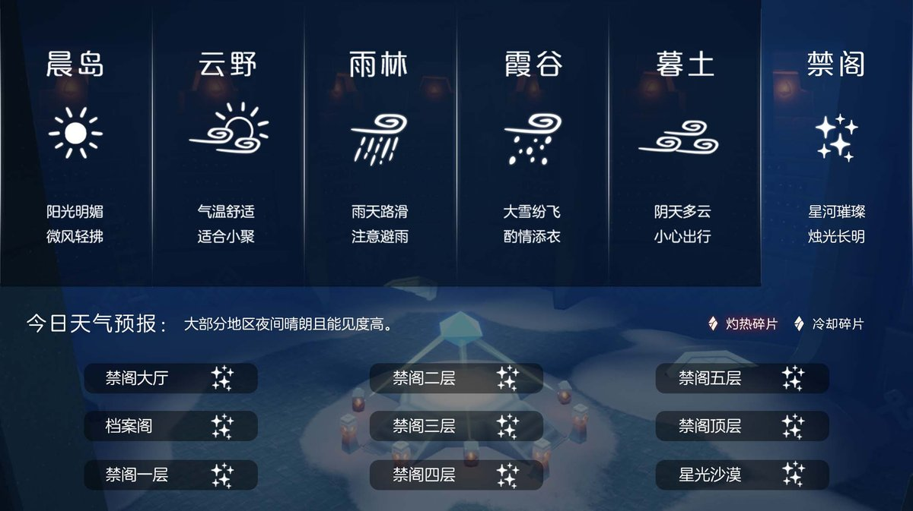

# 🌤 光遇每日任务

自动获取并展示《光·遇》每日任务和活动信息。

## 💡 项目说明

本项目通过自建 **SkyTools 控制台** 获取数据，使用 **GitHub Actions** 每日自动更新，将光遇的每日任务和活动信息展示在 README 中。

### 特性

- ✨ 每日自动更新任务和活动信息
- 🔒 账号与 Session 全部留在自建服务器，不外传
- 🚀 走 SkyTools `daily-tasks` 接口（游戏 `/account/get_season_quests`），无需第三方中转
- 📱 清晰的任务和活动展示
- ⏰ 北京时间每天 8:00 自动更新

---

<!-- DAILY_TASK_START -->
## 📅 2026年10月02日 每日任务

> 最后更新: 2026年10月02日 00:01:13 (北京时间)

### 🎯 今日旅行指南

**1. 在静谧庭院冥想**

【每日任务－在静谧庭院外冥想】
任务：在静谧庭院外冥想
位置：在雨林－静谧庭院
步骤：进入雨林大厅后往下飞下即是静谧庭院，着陆后往左前方跑即可看到

**2. 向一位玩家鞠躬**

【每日任务－向一位玩家招手】
亲爱的旅人，该任务需要您向任意一位玩家招手哦～面对面招手即可完成任务
温馨提示：若您没有招手动作，则先需找先祖获取。点击查看：

【云野·挥手钟匠】
先祖位置：进入云野仙乡，飞向中间的小岛，在小岛主路上，先祖就在路旁等候~
兑换图鉴：
大神推荐：迁徙季第九个任务，寻找迁徙钟匠！

**3. 在荧光小菇旁回复能量**

【飞行能量】
飞行能量介绍：
1.飞行能量是你用来漂浮和飞行时使用的能量
2.在移动的时候，你可以使用斗篷能量来使角色飞起来或在空中进行爬升。
3.站在其他玩家身边或者其他火光、收集表情或者飞行元气、和朋友击掌和拥抱都可以回复飞行能量。
4.你可以通过收集藏在世界各地的光翼，或者通过先祖兑换换取永久光翼来提升斗篷能量上限。

**4. 前往雨林-荧光森林，重温正步冒险家的回忆**

### 🌤️ 天气预报

天气播报：今日无碎片降落

### 📅 本月日历

### 🎪 今日活动

今日暂无特殊活动

---

<!-- DAILY_TASK_END -->
