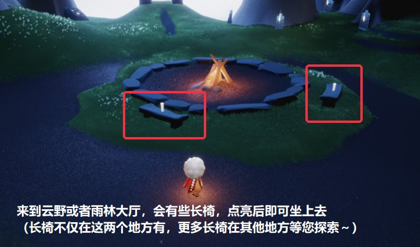
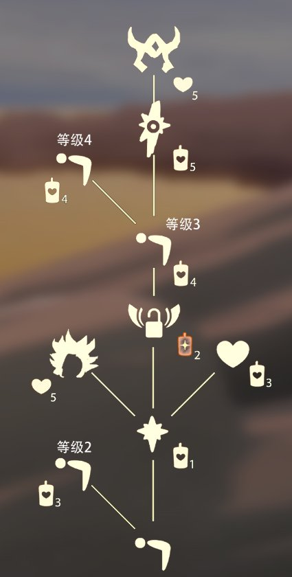
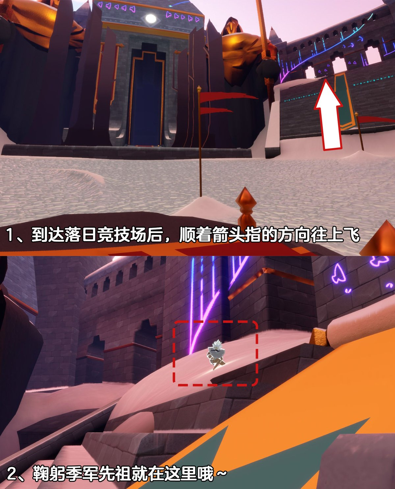
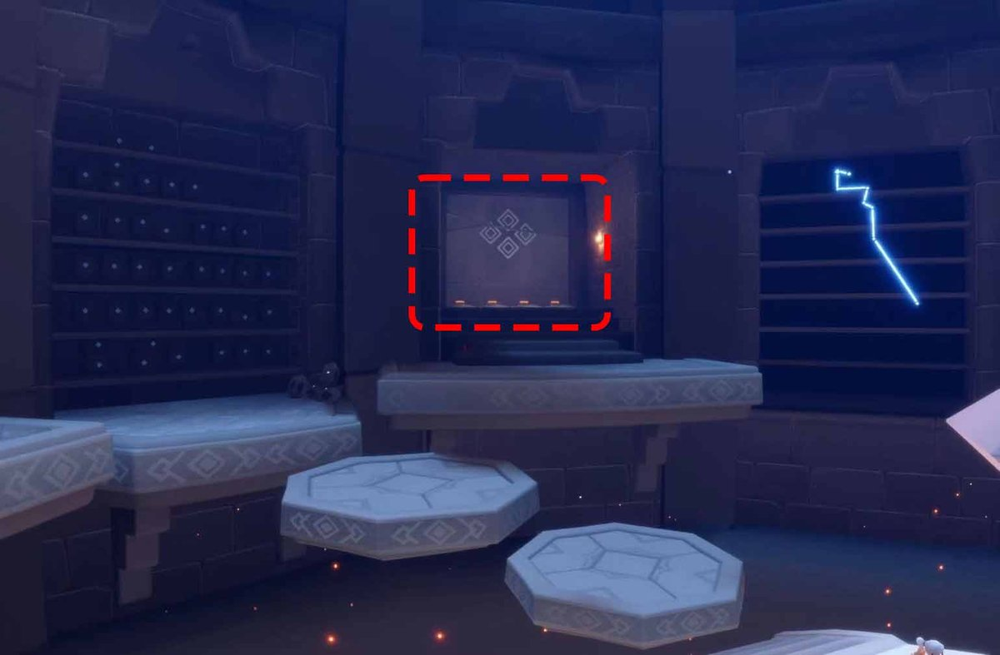
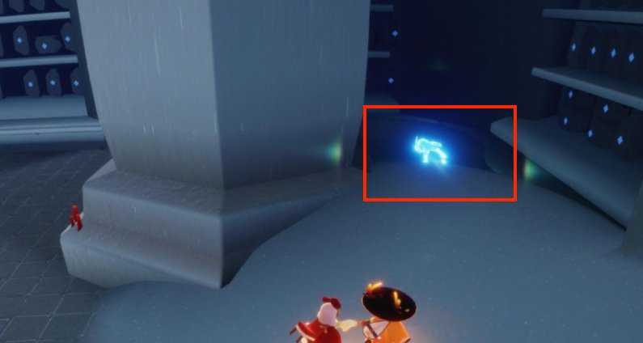
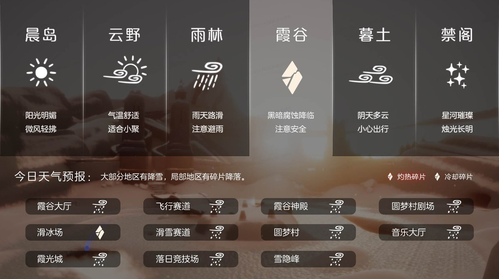
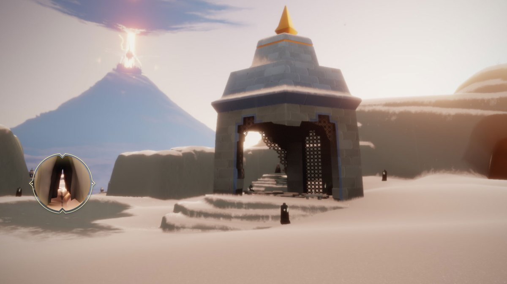
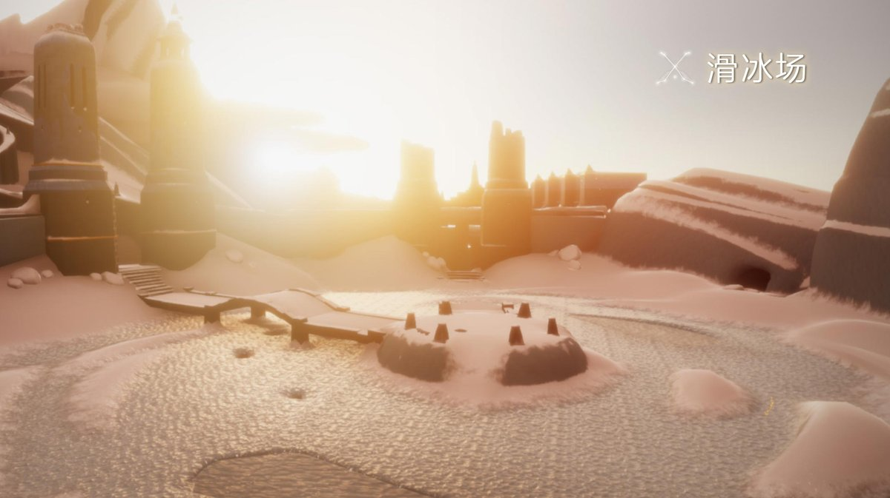
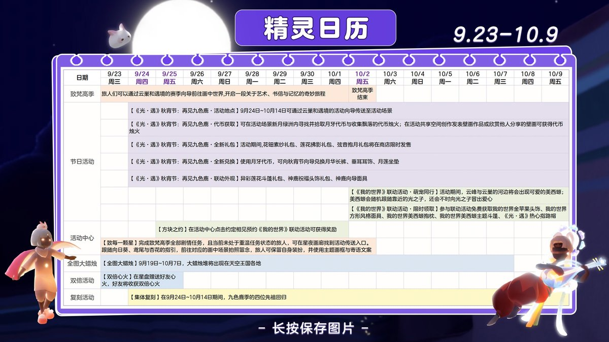

# 🌤 光遇每日任务

自动获取并展示《光·遇》每日任务和活动信息。

## 💡 项目说明

本项目通过自建 **SkyTools 控制台** 获取数据，使用 **GitHub Actions** 每日自动更新，将光遇的每日任务和活动信息展示在 README 中。

### 特性

- ✨ 每日自动更新任务和活动信息
- 🔒 账号与 Session 全部留在自建服务器，不外传
- 🚀 走 SkyTools `daily-tasks` 接口（游戏 `/account/get_season_quests`），无需第三方中转
- 📱 清晰的任务和活动展示
- ⏰ 北京时间每天 8:00 自动更新

---

<!-- DAILY_TASK_START -->
## 📅 2026年09月30日 每日任务

> 最后更新: 2026年09月30日 00:01:13 (北京时间)

### 🎯 今日旅行指南

**1. 和朋友击掌**

【和朋友击掌】
1.点击好友头顶的图标
2.解锁好友树里的击掌动作
3.点击击掌动作，发起击掌申请
4.好友接受击掌申请，即可和朋友击掌
点击查看：好友树

**2. 和陌生人一起坐在长凳上**

【和陌生人一起坐在长凳上】
步骤：
1.找到长凳(通常可在云野或雨林大厅中找到)
2.点亮长凳上的蜡烛
3.与陌生人(小黑)共坐同一张长凳

**3. 向一位玩家鞠躬**

【动作·鞠躬】 装扮、道具兑换指南服装收集
兑换先祖：霞谷·鞠躬季军 点击查看：先祖位置鞠躬季军
兑换图鉴：

【先祖怎么收集？服装怎么兑换？一次性说清楚！】

大神推荐： 梦想季熊抱雪人先祖收集攻略

【霞谷·鞠躬季军】
先祖位置：从霞谷的赛道一路滑行到达霞谷落日竞技场，神庙的右边城墙下有三个门洞，先祖在第一个门洞前等候~
视频攻略：

兑换图鉴：

**4. 前往禁阁-二层，重温浮空宗师的回忆**

【禁阁·浮空宗师】
先祖位置：来到禁阁的第二层后，打开四人门，在门背后的柱子边，先祖在静静等候~

### 🌤️ 天气预报

天气播报：今日将会有冷却碎片坠落在滑冰场
预测时间：09点08分、15点08分、21点08分（以游戏实际降落为准）

### 📅 本月日历

### 🎪 今日活动

今日暂无特殊活动

---

<!-- DAILY_TASK_END -->
