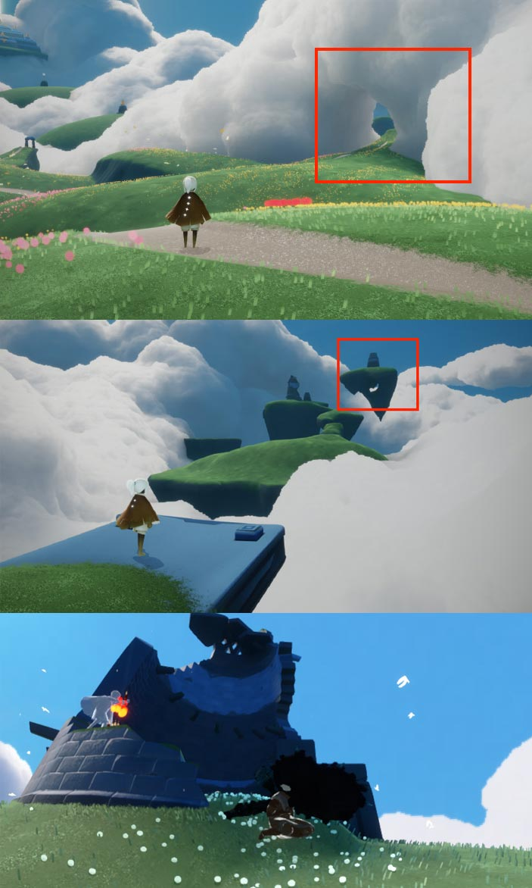
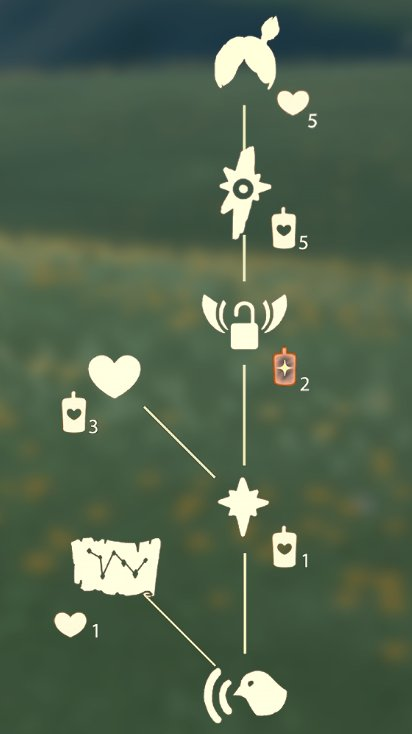
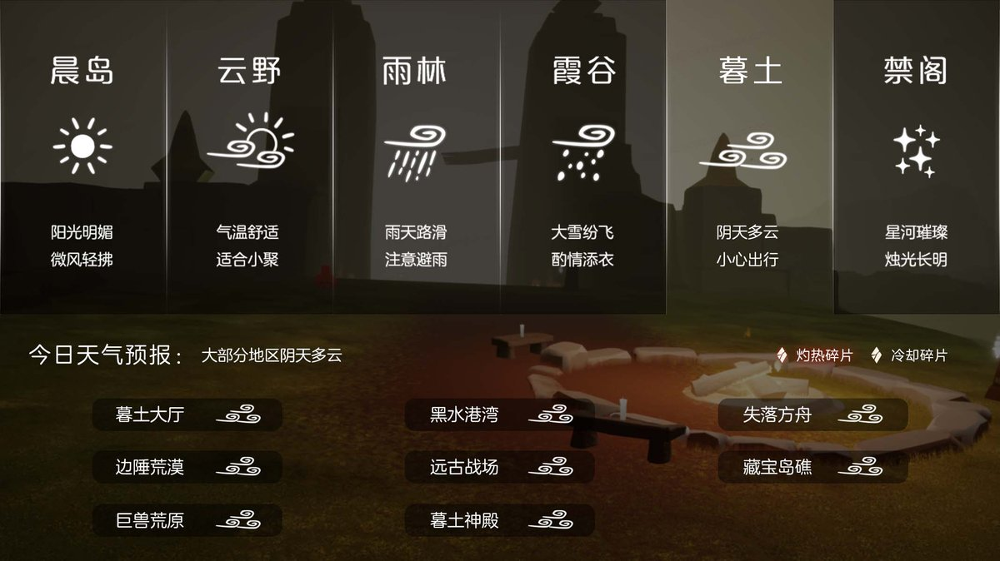

# 🌤 光遇每日任务

自动获取并展示《光·遇》每日任务和活动信息。

## 💡 项目说明

本项目通过自建 **SkyTools 控制台** 获取数据，使用 **GitHub Actions** 每日自动更新，将光遇的每日任务和活动信息展示在 README 中。

### 特性

- ✨ 每日自动更新任务和活动信息
- 🔒 账号与 Session 全部留在自建服务器，不外传
- 🚀 走 SkyTools `daily-tasks` 接口（游戏 `/account/get_season_quests`），无需第三方中转
- 📱 清晰的任务和活动展示
- ⏰ 北京时间每天 8:00 自动更新

---

<!-- DAILY_TASK_START -->
## 📅 2026年10月01日 每日任务

> 最后更新: 2026年10月01日 00:01:17 (北京时间)

### 🎯 今日旅行指南

**1. 向一位玩家招手**

【每日任务－向一位玩家招手】
亲爱的旅人，该任务需要您向任意一位玩家招手哦～面对面招手即可完成任务
温馨提示：若您没有招手动作，则先需找先祖获取。点击查看：

【云野·挥手钟匠】
先祖位置：进入云野仙乡，飞向中间的小岛，在小岛主路上，先祖就在路旁等候~
兑换图鉴：
大神推荐：迁徙季第九个任务，寻找迁徙钟匠！

**2. 净化10株黑暗植物**

【每日任务－净化10株黑暗植物】
1.地点：在雨林与暮土比较容易找到
2.净化：黑暗植物大小不一，旅人们可以举着蜡烛靠近，在火光的持续灼烧下黑暗植物会被清除。

**3. 在水母上恢复能量**

【每日任务－在水母上恢复能量】
位置：密林遗迹(水母图)
步骤：密林遗迹后往前飞，来到终点图前的雨亭，点亮蜡烛即可召唤出一排水母
注意：几乎消耗完能量后再跳上水母会更容易完成任务哦

**4. 前往云野-云顶浮石，重温鸟语者的回忆**

【云野·鸟语者】 点击查看：先祖位置：
1、先来到云野蝴蝶平原
2、在解锁四个云野先祖后右边会出现一个云洞，进入云洞前往云顶浮石
3、来到云顶浮石后飞到前方高处残塔前，先祖在塔下等候~

兑换图鉴：
温馨提示：
1、看不了图片的旅人可尝试刷新，或在网络较好的地点再试试哦；
2、若在图示位置找不到先祖，有可能是因为其他旅人正在收集，可重新进入地图再试试看～

【迁徙季先祖收集】 （看不了图片与视频指引的旅人可尝试刷新，或在网络较好的地点再试试哦，感谢旅人的支持！）
大神推荐：迁徙鸟语者兑换树解锁指南

### 🌤️ 天气预报

天气播报：今日无碎片降落

### 📅 本月日历

### 🎪 今日活动

今日暂无特殊活动

---

<!-- DAILY_TASK_END -->
