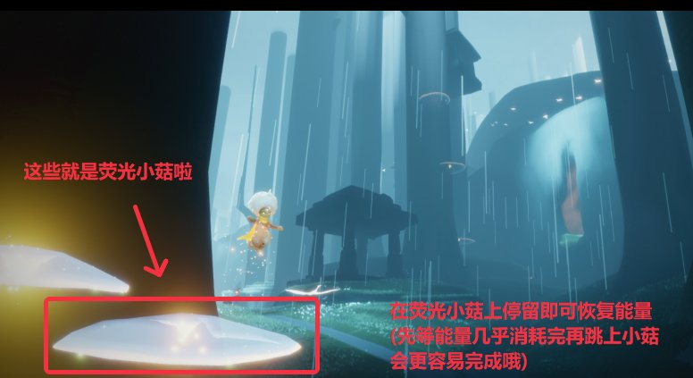
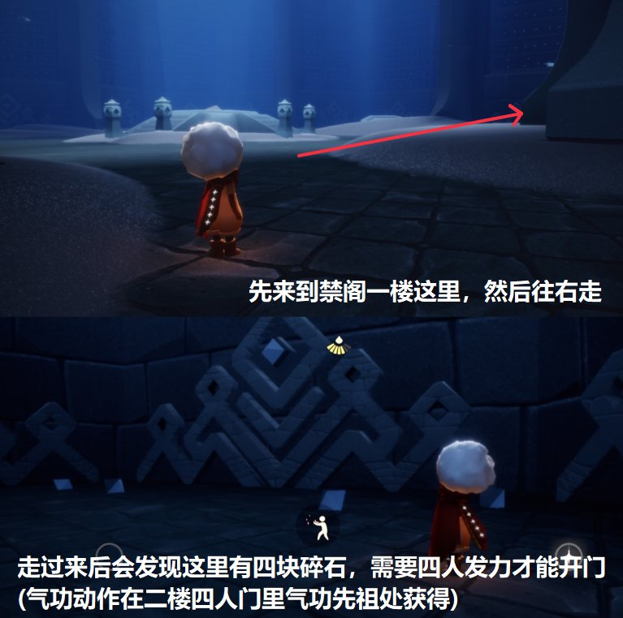
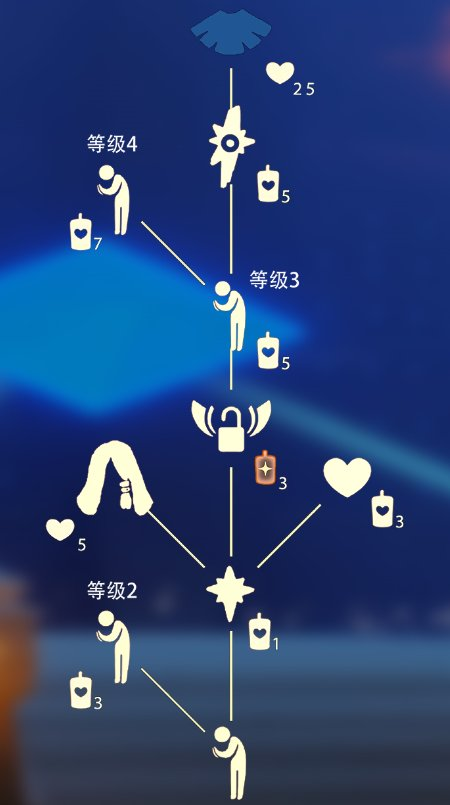
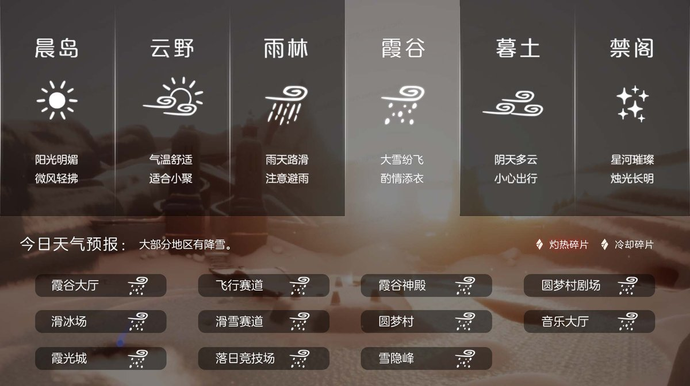

# 🌤 光遇每日任务

自动获取并展示《光·遇》每日任务和活动信息。

## 💡 项目说明

本项目通过自建 **SkyTools 控制台** 获取数据，使用 **GitHub Actions** 每日自动更新，将光遇的每日任务和活动信息展示在 README 中。

### 特性

- ✨ 每日自动更新任务和活动信息
- 🔒 账号与 Session 全部留在自建服务器，不外传
- 🚀 走 SkyTools `daily-tasks` 接口（游戏 `/account/get_season_quests`），无需第三方中转
- 📱 清晰的任务和活动展示
- ⏰ 北京时间每天 8:00 自动更新

---

<!-- DAILY_TASK_START -->
## 📅 2026年10月05日 每日任务

> 最后更新: 2026年10月05日 00:40:08 (北京时间)

### 🎯 今日旅行指南

**1. 净化10株黑暗植物**

【每日任务－净化10株黑暗植物】
1.地点：在雨林与暮土比较容易找到
2.净化：黑暗植物大小不一，旅人们可以举着蜡烛靠近，在火光的持续灼烧下黑暗植物会被清除。

**2. 接受一位朋友的礼物**

【追光汇暖·相约同庆·合服专属奖励】
合服活动已圆满结束！
奖励领取于1月16日24点截止，
现已停止领取。
感谢您的理解与支持！

**3. 在荧光小菇旁回复能量**

【荧光小菇】
小贴士：旅人们跳到荧光小菇上可补充能量
(能量几乎消耗完时再跳上去会更容易完成每日任务哦)
地点：荧光小菇是生长在雨林的植物。
特性：荧光小菇呈半透明状态并且会发光，旅人们站在荧光蘑菇上可以悬浮起来，极容易辨认。
如果小精灵的回答有帮助到您，请在右下角给小精灵点个赞哦~~

**4. 前往禁阁-一层，重温祈祷侍从的回忆**

【禁阁·祈祷侍从】
先祖位置：禁阁一楼四人门里
如何进入：
1.需先获得禁阁二层先祖的动作(气功动作) 第一层，在升降台的右侧和小伙伴合力打开四人门
3.先祖就在走廊的尽头安静等候~
兑换图鉴：

【禁阁·浮空宗师】
先祖位置：来到禁阁的第二层后，打开四人门，在门背后的柱子边，先祖在静静等候~

### 🌤️ 天气预报

天气播报：今日无碎片降落

### 📅 本月日历

### 🎪 今日活动

今日暂无特殊活动

---

<!-- DAILY_TASK_END -->
