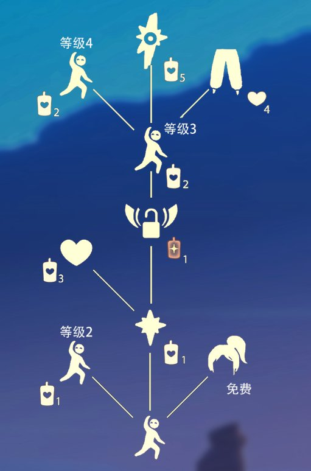
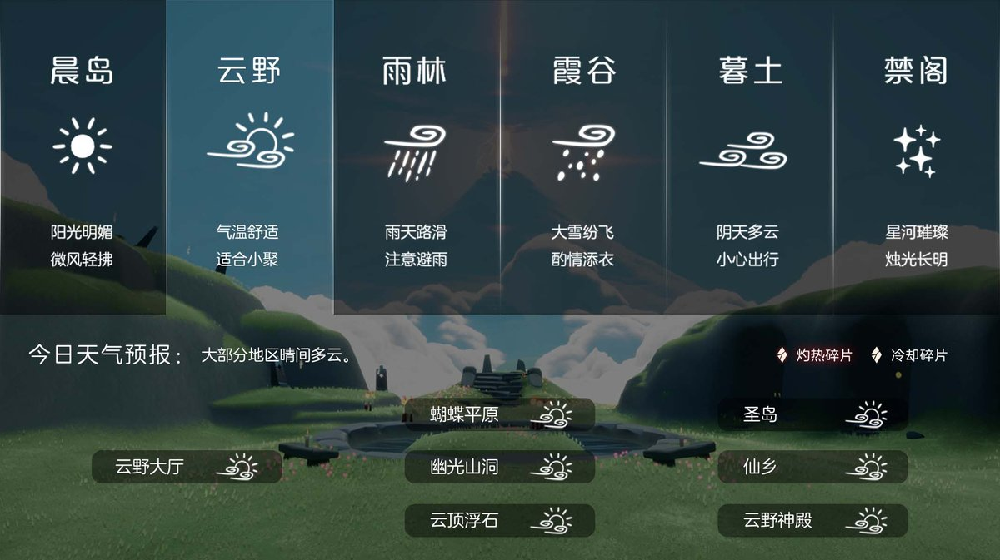
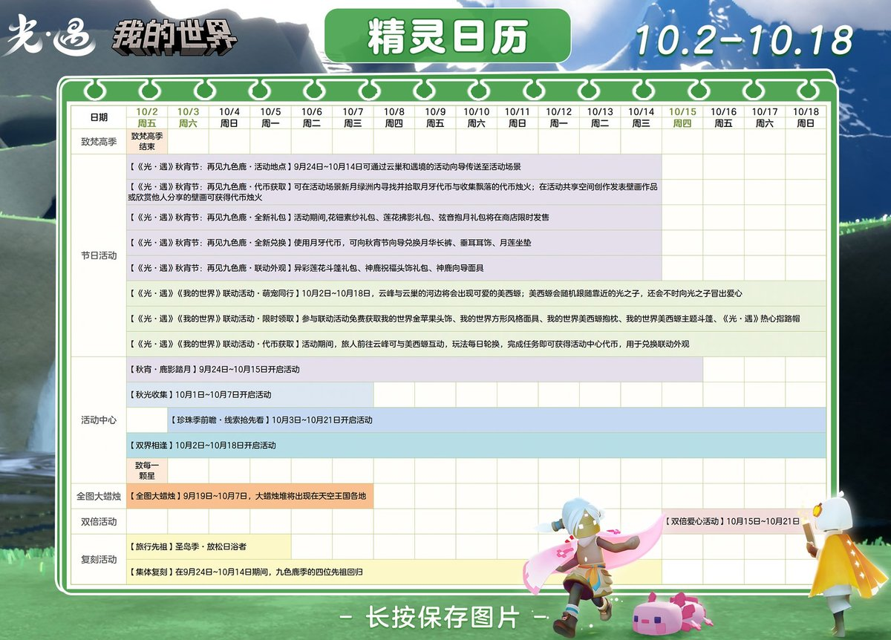

# 🌤 光遇每日任务

自动获取并展示《光·遇》每日任务和活动信息。

## 💡 项目说明

本项目通过自建 **SkyTools 控制台** 获取数据，使用 **GitHub Actions** 每日自动更新，将光遇的每日任务和活动信息展示在 README 中。

### 特性

- ✨ 每日自动更新任务和活动信息
- 🔒 账号与 Session 全部留在自建服务器，不外传
- 🚀 走 SkyTools `daily-tasks` 接口（游戏 `/account/get_season_quests`），无需第三方中转
- 📱 清晰的任务和活动展示
- ⏰ 北京时间每天 8:00 自动更新

---

<!-- DAILY_TASK_START -->
## 📅 2026年10月08日 每日任务

> 最后更新: 2026年10月08日 00:01:14 (北京时间)

### 🎯 今日旅行指南

**1. 收集30点烛火**

亲爱的旅人，若出现烛火、代币收取不正常的情况，可尝试重启登录游戏
若一直出现该问题，您可以通过以下方式反馈BUG和联系我们：
官方网站：
客服电话：95163920
登录客服专区：点击左侧客户服务，填写您的问题或建议详情，工作人员会尽快给您处理的哦～

**2. 向一位朋友招手**

【动作·招手】 装扮、道具兑换指南服装收集
兑换先祖：晨岛·引路观星者
兑换图鉴：

【先祖怎么收集？服装怎么兑换？一次性说清楚！】

大神推荐： 梦想季熊抱雪人先祖收集攻略

**3. 点燃20根蜡烛**

**4. 健忘说书人在圆梦村，需要你的帮助**

【霞谷·圆梦村】 点击查看：如何前往圆梦村路线

【场景·圆梦村】
位置：霞谷－圆梦村
指引：
1.先前往霞谷大厅
2.往右飞，即可找到圆梦村入口
温馨提示：进入圆梦村需要先收集一个暮土的先祖哦~
大神推荐： 梦想季熊抱雪人先祖收集攻略

### 🌤️ 天气预报

天气播报：今日无碎片降落

### 📅 本月日历

### 🎪 今日活动

今日暂无特殊活动

---

<!-- DAILY_TASK_END -->
