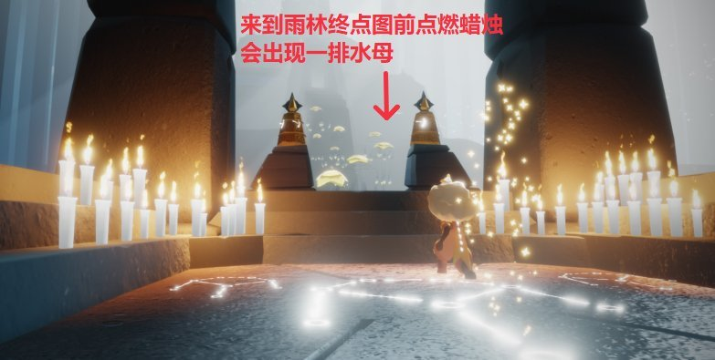
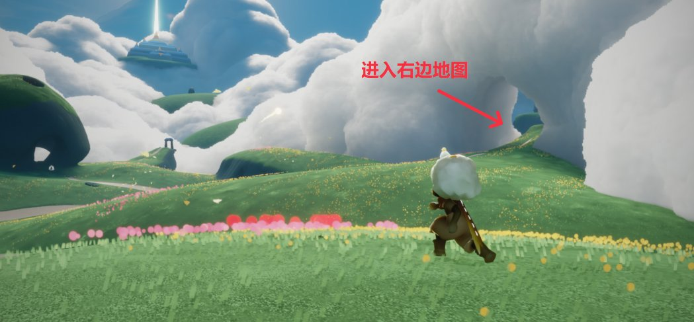
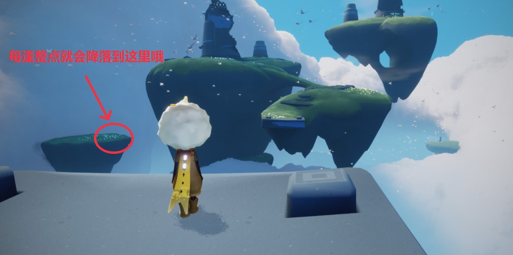
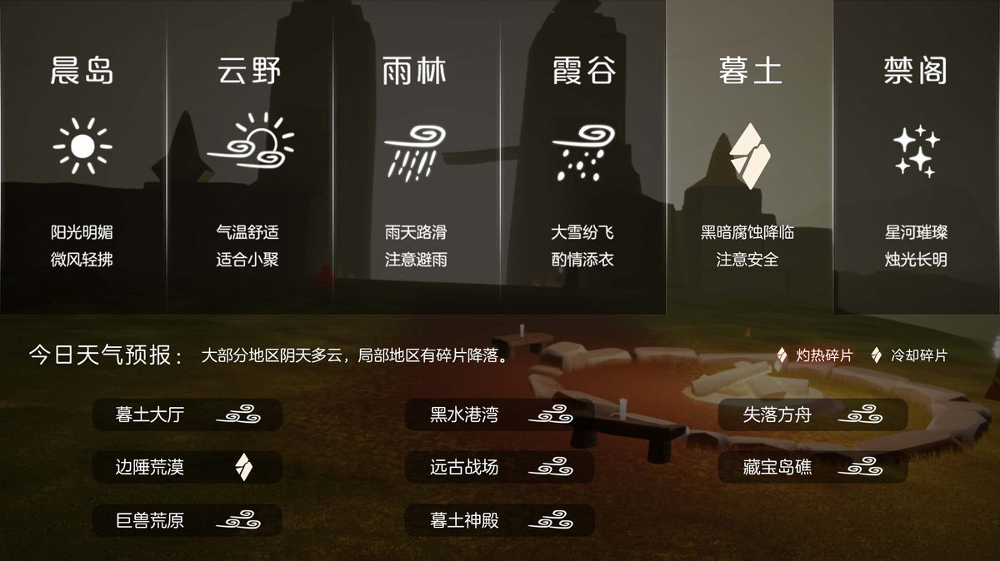
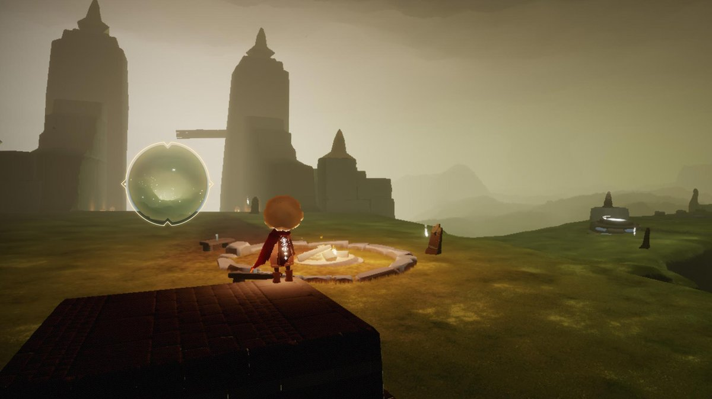
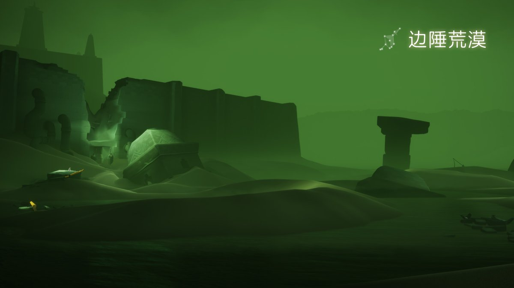

# 🌤 光遇每日任务

自动获取并展示《光·遇》每日任务和活动信息。

## 💡 项目说明

本项目通过自建 **SkyTools 控制台** 获取数据，使用 **GitHub Actions** 每日自动更新，将光遇的每日任务和活动信息展示在 README 中。

### 特性

- ✨ 每日自动更新任务和活动信息
- 🔒 账号与 Session 全部留在自建服务器，不外传
- 🚀 走 SkyTools `daily-tasks` 接口（游戏 `/account/get_season_quests`），无需第三方中转
- 📱 清晰的任务和活动展示
- ⏰ 北京时间每天 8:00 自动更新

---

<!-- DAILY_TASK_START -->
## 📅 2026年10月06日 每日任务

> 最后更新: 2026年10月06日 00:40:11 (北京时间)

### 🎯 今日旅行指南

**1. 向一位朋友做个动作**

【好友互动动作】
使用：点击好友头上的互动按钮，在好友菜单里选择动作
温馨提示：某些互动动作需要先通过先祖或旅行先祖解锁才能获得

**2. 和朋友击掌**

【和朋友击掌】
1.点击好友头顶的图标
2.解锁好友树里的击掌动作
3.点击击掌动作，发起击掌申请
4.好友接受击掌申请，即可和朋友击掌
点击查看：好友树

**3. 在水母上恢复能量**

【每日任务－在水母上恢复能量】
位置：密林遗迹(水母图)
步骤：密林遗迹后往前飞，来到终点图前的雨亭，点亮蜡烛即可召唤出一排水母
注意：几乎消耗完能量后再跳上水母会更容易完成任务哦

**4. 收集绿色光芒**

【绿色光芒】
光芒位置：云野右侧隐藏图
位置指引：进入云野后，往右进入云顶浮石，前往左边第一个浮岛，绿色光芒会在每一个整点降落
温馨提示：（请耐心看完，非常重要）
1、例如00:30、4:50、8:20这些刚好到10的整数的都是整点
2、不建议踩点到达，建议提前一两分钟在上述地点等待，踩点到达非常容易错过
3、若无论如何等待都无法看见光芒，请检查是否已接取相关任务
如果小精灵的回答有帮助到您，请在右下角给小精灵点个赞哦~

### 🌤️ 天气预报

天气播报：大部分地区地区阴天多云，边陲荒漠将会有冷却碎片降落
降落时间：09点08分、14点08分、19点08分（以游戏实际降落为准）

### 📅 本月日历

### 🎪 今日活动

今日暂无特殊活动

---

<!-- DAILY_TASK_END -->
