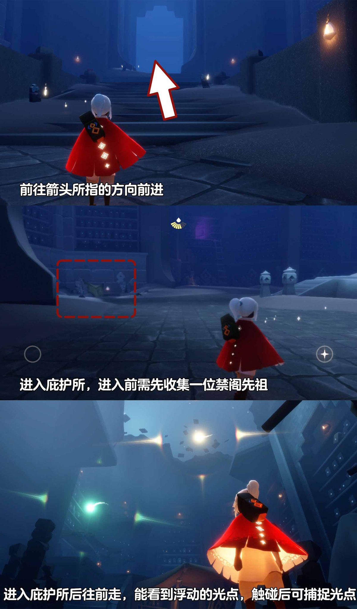
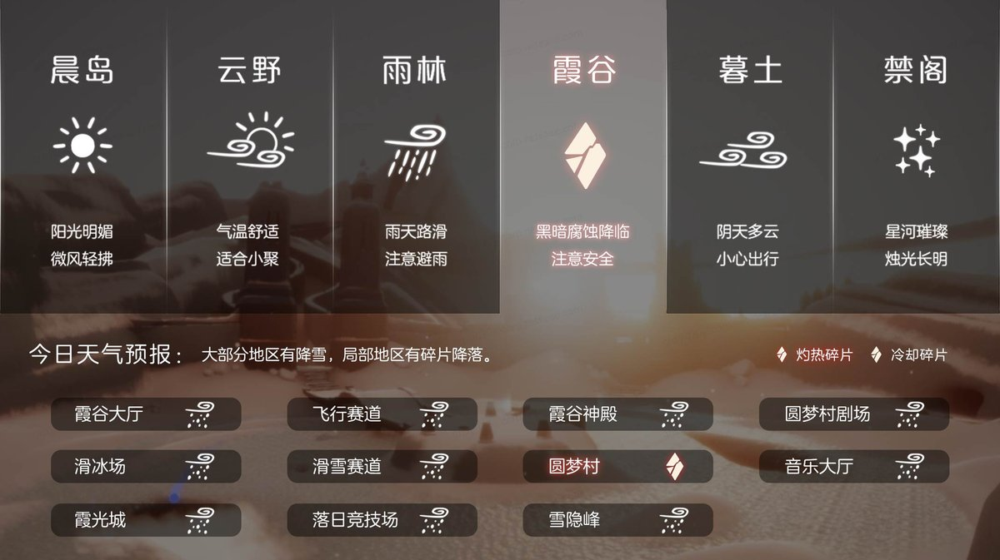

# 🌤 光遇每日任务

自动获取并展示《光·遇》每日任务和活动信息。

## 💡 项目说明

本项目通过自建 **SkyTools 控制台** 获取数据，使用 **GitHub Actions** 每日自动更新，将光遇的每日任务和活动信息展示在 README 中。

### 特性

- ✨ 每日自动更新任务和活动信息
- 🔒 账号与 Session 全部留在自建服务器，不外传
- 🚀 走 SkyTools `daily-tasks` 接口（游戏 `/account/get_season_quests`），无需第三方中转
- 📱 清晰的任务和活动展示
- ⏰ 北京时间每天 8:00 自动更新

---

<!-- DAILY_TASK_START -->
## 📅 2026年10月10日 每日任务

> 最后更新: 2026年10月10日 00:01:10 (北京时间)

### 🎯 今日旅行指南

**1. 在禁阁的庇护所中捕捉浮动的光点**

【在禁阁的庇护所中捕捉浮动的光点】
1、前往禁阁大厅，进入庇护所
2、进入庇护所后往前走，浮动的光点就在前方飞
3、触碰后可捕捉光点
小精灵提醒您：
1、进入庇护前所需要收集一位禁阁常驻先祖
2、需要收集三个光点
3、在收集过程中若光点消失，旅人可尝试重新进入地图
视频攻略：

**2. 在水母上恢复能量**

【每日任务－在水母上恢复能量】
位置：密林遗迹(水母图)
步骤：密林遗迹后往前飞，来到终点图前的雨亭，点亮蜡烛即可召唤出一排水母
注意：几乎消耗完能量后再跳上水母会更容易完成任务哦

**3. 点燃20根蜡烛**

**4. 在禁阁神殿冥想**

【每日任务－在禁阁的神坛旁冥想】
任务：在禁阁的神坛旁冥想
位置：禁阁终点旁
步骤：进入禁阁后一直上到第六层(最高层)，往左前方走就看到啦

### 🌤️ 天气预报

天气播报：大部分地区地区夜间晴朗，圆梦村将会有灼热碎片降落
降落时间：10点08分、14点08分、22点08分（以游戏实际降落为准）

### 📅 本月日历

### 🎪 今日活动

今日暂无特殊活动

---

<!-- DAILY_TASK_END -->
