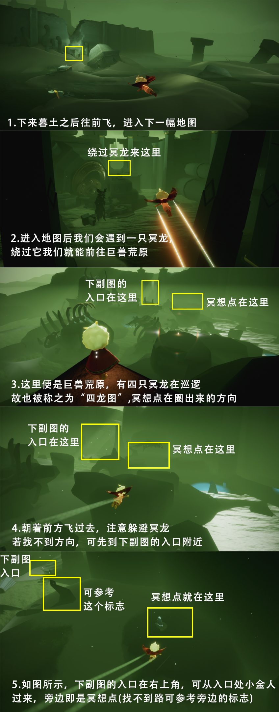
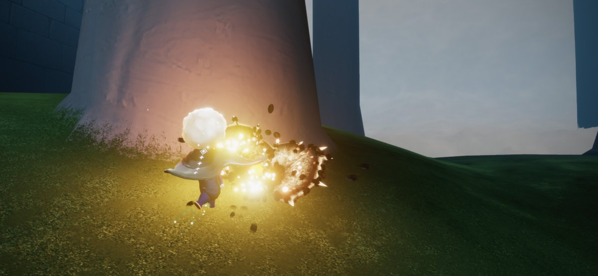
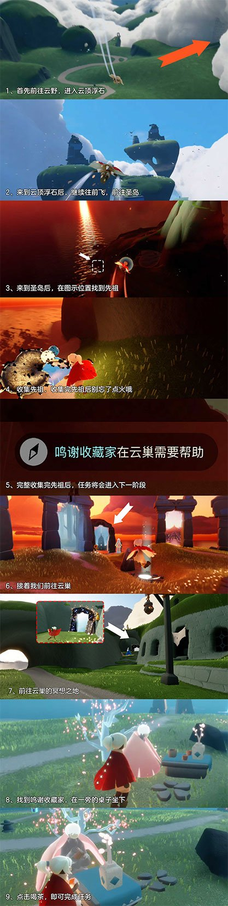
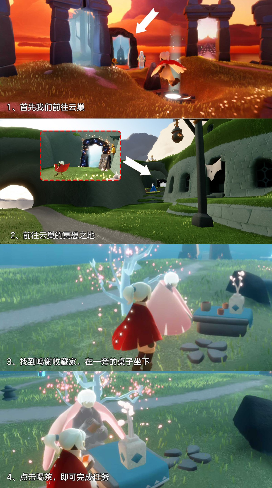
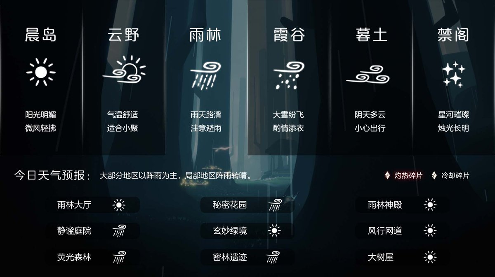

# 🌤 光遇每日任务

自动获取并展示《光·遇》每日任务和活动信息。

## 💡 项目说明

本项目通过自建 **SkyTools 控制台** 获取数据，使用 **GitHub Actions** 每日自动更新，将光遇的每日任务和活动信息展示在 README 中。

### 特性

- ✨ 每日自动更新任务和活动信息
- 🔒 账号与 Session 全部留在自建服务器，不外传
- 🚀 走 SkyTools `daily-tasks` 接口（游戏 `/account/get_season_quests`），无需第三方中转
- 📱 清晰的任务和活动展示
- ⏰ 北京时间每天 8:00 自动更新

---

<!-- DAILY_TASK_START -->
## 📅 2026年10月09日 每日任务

> 最后更新: 2026年10月09日 00:01:15 (北京时间)

### 🎯 今日旅行指南

**1. 在巨兽荒原的神坛旁冥想**

【每日任务－在巨兽荒原的神坛旁冥想】
任务：在巨兽荒原的神坛旁冥想
位置：暮土－巨兽荒原(四龙图)
步骤：先进入暮土四龙图，往前飞，在下一个图的入口附近即可找到
大神推荐：查收你的光翼收集报告

**2. 向一位玩家鞠躬**

【动作·鞠躬】 装扮、道具兑换指南服装收集
兑换先祖：霞谷·鞠躬季军 点击查看：先祖位置鞠躬季军
兑换图鉴：

【先祖怎么收集？服装怎么兑换？一次性说清楚！】

大神推荐： 梦想季熊抱雪人先祖收集攻略

【霞谷·鞠躬季军】
先祖位置：从霞谷的赛道一路滑行到达霞谷落日竞技场，神庙的右边城墙下有三个门洞，先祖在第一个门洞前等候~
视频攻略：

兑换图鉴：

**3. 净化10株黑暗植物**

【每日任务－净化10株黑暗植物】
1.地点：在雨林与暮土比较容易找到
2.净化：黑暗植物大小不一，旅人们可以举着蜡烛靠近，在火光的持续灼烧下黑暗植物会被清除。

**4. 与鸣谢收藏家一起品茶**

【每日任务－帮助鸣谢收藏家】
请旅人先查看接到的任务名称，然后在下方选择对应指南
｜
小精灵提示：
1、若旅人从未收集过该先祖，任务会显示为：在圣岛找到鸣谢收藏家；
2、若旅人之前已收集过该先祖，任务会显示为：鸣谢收藏家在云巢需要帮助。

【在圣岛找到鸣谢收藏家】
先祖位置：云野·圣岛
任务流程：
1、先前往圣岛找到并收集鸣谢收藏家先祖
2、接着前往云巢
3、在云巢找到冥想之地
4、找到鸣谢收藏家先祖，并在旁边的桌子坐下
5、坐下后点击喝茶，即可完成任务

【鸣谢收藏家在云巢需要帮助】
先祖位置：云巢·冥想之地
任务流程：
1、在云巢找到冥想之地
2、找到鸣谢收藏家先祖，并在旁边的桌子坐下
3、坐下后点击喝茶，即可完成任务

### 🌤️ 天气预报

天气播报：今日无碎片降落

### 📅 本月日历

### 🎪 今日活动

今日暂无特殊活动

---

<!-- DAILY_TASK_END -->
